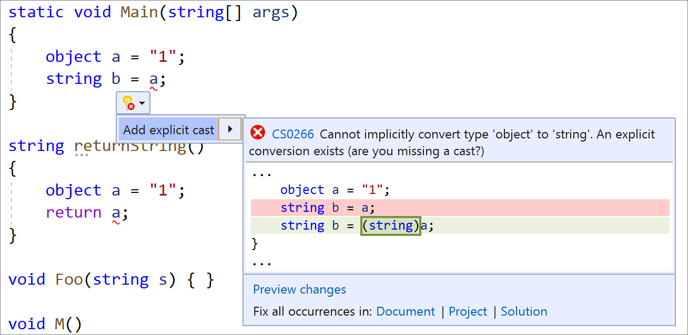

# Add explicit cast

This code generation applies to:

- C#

**What:** Lets you automatically add an explicit cast to an expression, based on usage.

**When:** You need to add an explicit cast to an expression and want to properly assign it automatically.

**Why:** You could add an explicit cast to an expression manually, however this feature adds it automatically based on the code context.

## How to use it

1. Place your caret on the error.
2. Press **Ctrl**+**.** to trigger the **Quick Actions and Refactorings** menu.
3. Select **Add explicit cast**.

   

## See also

- [Code Generation](../code-generation-in-visual-studio.md)
- [Refactoring](../refactoring-in-visual-studio.md)
