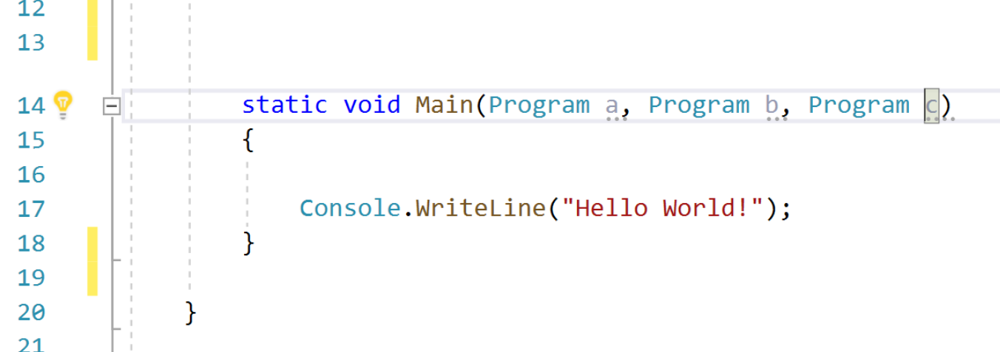
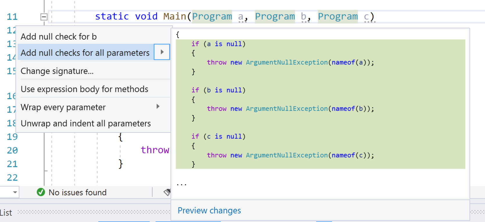

--- 
title: Add null checks for all (parameters) 
description: Learn how to create and add if statements to your code that check nullity of all the nullable, non-checked parameters.
ms.date: 09/17/2019 
ms.topic: reference 
ms.custom: "ide-ref"
author: mikadumont
ms.author: midumont
manager: mijacobs 
dev_langs: 
  - CSharp 
--- 
# Add null checks for all parameters 

This refactoring applies to: 

- C# 

**What:** Creates and adds `if` statements that check nullity of all the nullable, non-checked parameters. 

**When:** You want to quickly add null checks for all applicable method parameters.

**Why:** Writing null checks for many parameters can be time consuming and repetitive. Using this refactoring is quick and makes the program more robust.  

## How-to 

1. Place your cursor on any parameter within the method.

2. Press **Ctrl**+**.** to trigger the **Quick Actions and Refactorings** menu.

   
   
3. Select the option to **Add null checks for all parameters**.

   

## See also 

- [Refactoring](../refactoring-in-visual-studio.md)
