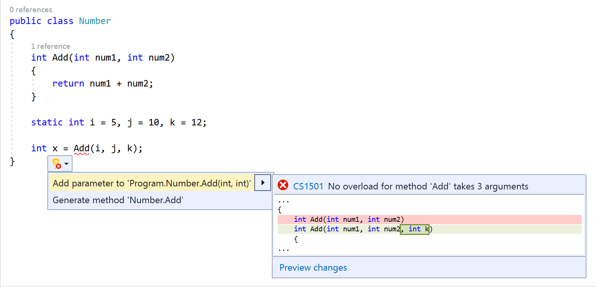

# Add a parameter to a method using a Quick Action

This code generation applies to:

- C#

- Visual Basic

**What:** Lets you automatically add a parameter to a method, based on usage.

**When:** You need to add a parameter to a method and want to properly declare it automatically.

**Why:** You could add the parameter to the method declaration before calling it, however this feature adds it automatically based on a method call.

## How to use it

1. Add an extra argument to a method call.

   A red squiggle appears under the name of the method where you call it.

2. Place your pointer over the red squiggle until the Quick Actions menu appears. Select the **down arrow** on the Quick Actions menu, and then select **Add parameter to [method]**.

   

   > [!TIP]
   > You can also access the Quick Actions menu by placing your cursor on the line of the method call, and then either pressing **Ctrl**+**.** (period) or selecting the light bulb icon in the file margin.

   Visual Studio adds the new parameter to the method declaration.

> [!NOTE]
> If you have other calls to the method, they may produce errors after you use this Quick Action, because they don't specify an argument for the newly added parameter.

## See also

- [Add parameter to constructor](generate-constructor.md#addparameter)
