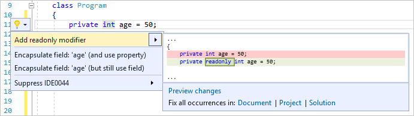

# Refactoring to add a readonly modifier

Use this refactoring to add the [readonly (C#)](/dotnet/csharp/language-reference/keywords/readonly) or [ReadOnly (Visual Basic)](/dotnet/visual-basic/language-reference/modifiers/readonly) modifier to a static or instance field declaration.

Use this refactoring to conform code to the code style setting for **Prefer readonly**. The **Prefer readonly** code style setting is configured in **Tools** > **Options** > **Text Editor** > **C#** or **Basic** > **Code Style** > **General** > **Field preferences**. If the **Prefer readonly** preference value is **No**, this refactoring doesn't appear as a Quick Action.

This refactoring applies to:

- C#

- Visual Basic

## Why add readonly

Fields marked [readonly](/dotnet/csharp/language-reference/keywords/readonly) can be assigned a value only in the field declaration itself, or in a constructor of the class it's declared in. The [readonly](/dotnet/csharp/language-reference/keywords/readonly) keyword can be applied to both static and instance fields.

## How to use it

1. Place your cursor anywhere on the line that contains the field declaration.

   > [!NOTE]
   > The **Add readonly modifier** refactoring is only available on fields than *can* be marked [readonly](/dotnet/csharp/language-reference/keywords/readonly). If the field is assigned a value anywhere other than in a constructor or as part of the declaration, the refactoring is not available. Also, if the field is used as an [out](/dotnet/csharp/language-reference/keywords/out-parameter-modifier.md) or [ref](/dotnet/csharp/language-reference/keywords/ref.md) parameter anywhere other than in a constructor, the refactoring is not available.

1. Press **Ctrl**+**.** or click the light bulb  icon in the margin of the code file.

   

1. Select **Add readonly modifier**. Or, select **Preview changes** to open the [Preview Changes](../../ide/preview-changes.md) dialog, and then select **Apply**.

## See also

- [readonly keyword (C#)](/dotnet/csharp/language-reference/keywords/readonly)
- [ReadOnly modifier (Visual Basic)](/dotnet/visual-basic/language-reference/modifiers/readonly)
- [Refactoring](../refactoring-in-visual-studio.md)
- [Preview Changes](../../ide/preview-changes.md)