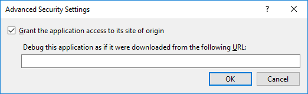

# Advanced Security Settings dialog box

This dialog box allows you to specify security settings related to debugging in zone.

To access this dialog box, select a project node in **Solution Explorer**, and then, on the **Project** menu, click **Properties**. When the **Project Designer** appears, click the **Security** tab. On the **Security** page, select **Enable ClickOnce Security Settings**, click **This is a partial trust application**, and then click **Advanced**.

## UIElement list

**Grant the application access to its site of origin**

If you select this check box, the application can access the website or server share on which it is published. By default, this option is selected.

**Debug this application as if it were downloaded from the following URL**

If you have to allow the application to access the website or server share corresponding to the **Installation URL** you specified on the **Publish** page, enter that URL here. This option is available only when **Grant the application access to its site of origin** is selected.

## See also

- [Security Page, Project Designer](../../ide/reference/security-page-project-designer.md)
