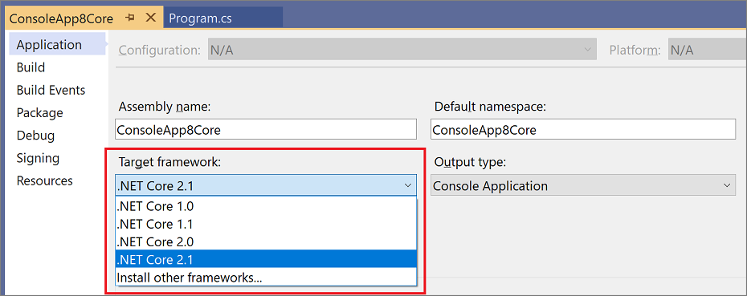

# Application Page, Project Designer (C#)

Use the **Application** page of the **Project Designer** to specify the project's application settings and properties.

To access the **Application** page, choose a project node (not the **Solution** node) in **Solution Explorer**. Then choose **Project** > **Properties** on the menu bar. When the **Project Designer** appears, click the **Application** tab.

[!INCLUDE[note_settings_general](../../data-tools/includes/note_settings_general_md.md)]

## General Application Settings

The following options enable you to configure general settings for the application.

**Assembly name**

Specifies the name of the output file that will hold the assembly manifest. Changing this property also changes the **Output Name** property.

You can also make this change from the command line by using [/out (C# Compiler Options)](/dotnet/csharp/language-reference/compiler-options/out-compiler-option).

To access this property programmatically, see <xref:VSLangProj.ProjectProperties.AssemblyName%2A>.

**Default namespace**

Specifies the base namespace for files added to the project.

See [namespace](/dotnet/csharp/language-reference/keywords/namespace) for more information about creating namespaces in your code.

To access this property programmatically, see <xref:VSLangProj.ProjectProperties.RootNamespace%2A>.

**Target Framework**

Specifies the version of .NET that the application targets. This option can have different values depending on which versions of .NET are installed on your computer.

For .NET Framework projects, the default value matches the target framework that you specified when you created the project.

> [!NOTE]
> The prerequisite packages listed in the [Prerequisites Dialog Box](../../ide/reference/prerequisites-dialog-box.md) are set automatically the first time that you open the dialog box. If you subsequently change the project's target framework, you must select the prerequisites manually to match the new target framework.

For more information, see [Framework targeting overview](../../ide/visual-studio-multi-targeting-overview.md).

**Output type**

Specifies the type of application to build. The values are different depending on the project type. For example, for a **Console App** project, you can specify **Windows Application**, **Console Application**, or **Class Library** as the output type.

For a web application project, you must specify **Class Library**.

For more information about the **Output type** property, see [/target (C# Compiler Options)](/dotnet/csharp/language-reference/compiler-options/target-compiler-option).

For information about how to access this property programmatically, see <xref:VSLangProj.ProjectProperties.OutputType%2A>.

**Auto-generate binding redirects**

Binding redirects are added to your project if your app or its components reference more than one version of the same assembly. If you want to manually define binding redirects in the project file, deselect **Auto-generate binding redirects**.

For more information about redirection, see [Redirecting assembly versions](/dotnet/framework/configure-apps/redirect-assembly-versions).

**Startup object**

Defines the entry point to be called when the application loads. Generally this is set either to the main form in your application or to the `Main` procedure that should run when the application starts. Because class libraries do not have an entry point, their only option for this property is **(Not set)**.

By default, in a WPF app project, this option is set to **(Not set)**. The other option is \[projectname].App. In a WPF project, you must set the startup URI to load a UI resource when the application starts. To do this, open the *Application.xaml* file in your project and set the `StartupUri` property to a *.xaml* file in your project, such as *Window1.xaml*. For a list of acceptable root elements, see <xref:System.Windows.Application.StartupUri%2A>. You must also define a `public static void Main()` method in a class in the project. This class will appear in the **Startup object** list as *ProjectName.ClassName*. You can then select the class as the startup object.

See [/main (C# Compiler Options)](/dotnet/csharp/language-reference/compiler-options/main-compiler-option) for more information. To access this property programmatically, see <xref:VSLangProj.ProjectProperties.StartupObject%2A>.

**Assembly Information**

This button opens the [Assembly Information](../../ide/reference/assembly-information-dialog-box.md) dialog box.

## Resources

The **Resources** options help you configure resource settings for your app.

**Icon and manifest**

By default, this radio button is selected and the **Icon** and **Manifest** options are enabled. This enables you to select your own icon or to select different manifest generation options. Leave this radio button selected unless you're providing a resource file for the project.

**Icon**

Sets the *.ico* file that you want to use as your program icon. Click **Browse** to browse for an existing graphic, or type the name of the file that you want. See [/win32icon (C# Compiler Options)](/dotnet/csharp/language-reference/compiler-options/win32icon-compiler-option) for more information.

To access this property programmatically, see <xref:VSLangProj.ProjectProperties.ApplicationIcon%2A>.

For information about creating an icon, see [Image editor for icons](/cpp/windows/image-editor-for-icons).

**Manifest**

Selects a manifest generation option when the application runs on Windows under User Account Control (UAC). This option can have the following values:

- **Embed manifest with default settings**. Supports the typical manner in which Visual Studio operates on Windows, which is to embed security information in the application's executable file, specifying that `requestedExecutionLevel` be `AsInvoker`. This is the default option.

- **Create application without a manifest**. This method is known as *virtualization*. Use this option for compatibility with earlier applications.

- **Properties\app.manifest**. This option is required for applications deployed by ClickOnce or Registration-Free COM. If you publish an application by using ClickOnce deployment, **Manifest** is automatically set to this option.

**Resource file**

Select this radio button when you're providing a resource file for the project. Selecting this option disables the **Icon** and **Manifest** options.

Enter a path name or use the Browse button (**...**) to add a Win32 resource file to the project.

For more information, see [Create resource files for .NET apps](/dotnet/framework/resources/creating-resource-files-for-desktop-apps).

## See also

[Revamped Project Properties UI](https://devblogs.microsoft.com/visualstudio/revamped-project-properties-ui/)