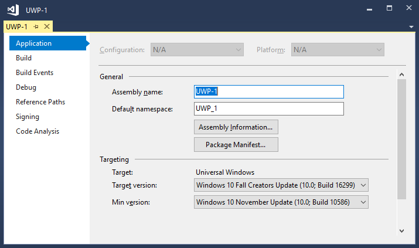

# Application property page (UWP projects)

Use the **Application** property page to specify the Universal Windows Platform (UWP) project's assembly and package information, and target Windows 10 version.

To access the **Application** page, choose the project node in **Solution Explorer**. Then choose **Project** > **Properties** on the menu bar. The property pages open on the **Application** tab.

## General section

**Assembly name**&mdash;Specifies the name of the output file that will hold the assembly manifest.

To access this property programmatically, see <xref:VSLangProj.ProjectProperties.AssemblyName%2A>.

**Default namespace**&mdash;Specifies the base namespace for files added to the project. For more information about namespaces, see [Namespaces (C# programming guide)](/dotnet/csharp/programming-guide/namespaces/), [Namespaces (Visual Basic)](/dotnet/visual-basic/programming-guide/program-structure/namespaces), or [Namespaces (C++)](/cpp/cpp/namespaces-cpp).

To access this property programmatically, see <xref:VSLangProj.ProjectProperties.RootNamespace%2A>.

**Assembly Information**&mdash;Choosing this button displays the [Assembly Information dialog box](../../ide/reference/assembly-information-dialog-box.md).

**Package Manifest**&mdash;Choosing this button opens the manifest designer. The manifest designer can also be accessed by choosing the _Package.appxmanifest_ file in **Solution Explorer**. For more information, see [Configure a package with the manifest designer](/windows/uwp/packaging/packaging-uwp-apps#configure-an-app-package).

## Targeting section

You can set the target version and minimum version of Windows 10 for your app by using the drop-down lists in this section. It is recommended that you target the latest version of Windows 10, and if you are developing an enterprise app, that you support an older minimum version too. For more information about which Windows 10 version to choose, see [Choose a UWP version](/windows/uwp/updates-and-versions/choose-a-uwp-version).

For information about platform targeting in Visual Studio, see [Platform targeting](/visualstudio/productinfo/vs2017-compatibility-vs#platform-targeting).

## See also

- [Create your first UWP app](/windows/uwp/get-started/your-first-app)
- [Choose a UWP version](/windows/uwp/updates-and-versions/choose-a-uwp-version)