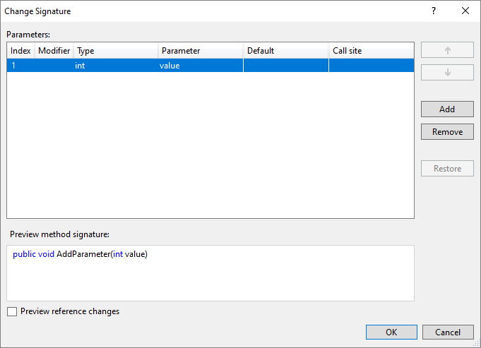
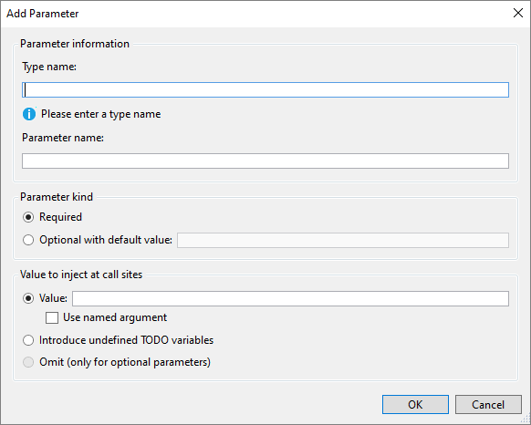

# Change a method signature refactoring

This refactoring applies to:

- C#

- Visual Basic

**What:** Lets you remove or change the order of a method's parameters.

**When:** You want to move or remove a method parameter that is currently being used in a variety of locations.

**Why:** You could manually remove and re-order the parameters, and then find all calls to that method and change them one-by-one, but that could lead to errors.  This refactoring tool will perform the task automatically.

## How-to

1. Highlight or place the text cursor inside the name of the method to modify, or one of its usages:

   - C#:

       

   - VB:

       

2. Next, do one of the following:

   - **Keyboard**
      - Press **Ctrl+R**, then **Ctrl+V**.  (Note that your keyboard shortcut may be different based on which profile you've selected.)
      - Press **Ctrl**+**.** to trigger the **Quick Actions and Refactorings** menu and select **Change Signature** from the Preview window popup.
   - **Mouse**
      - Select **Edit > Refactor > Remove Parameters**.
      - Select **Edit > Refactor > Reorder Parameters**.
      - Right-click the code, select the **Quick Actions and Refactorings** menu and select **Change Signature** from the Preview window popup.

3. In the **Change Signature** dialog that pops up, you can use the buttons on the right side to change the method signature:

   

   | Button | Description
   | ------ | ---
   | **Up/Down** | Move the selected parameter up and down the list
   | **Add** | Add a new parameter to the list
   | **Remove** | Remove the selected parameter from the list
   | **Restore** | Restore the selected, crossed-out parameter to the list

   > [!TIP]
   > Use the **Preview reference changes** checkbox to [see what the result will be](../../ide/preview-changes.md) before committing to it.

4. Selecting **Add** in the **Change Signature** dialog will open the **Add Parameter** dialog. The **Add Parameter** dialog allows you to add a type name and a parameter name. You can choose to make the parameter required or optional with a default value. You can then add a value at the call site and choose a named argument for that value or you can introduce a TODO variable. The TODO variable puts a TODO in your code so you can visit each error and go through each call site independently and decide what to pass. For optional parameters you have the option to omit the call site completely.

    

5. When you are finished adding a parameter, press **OK** to preview the changes.

    

## See also

- [Refactoring](../refactoring-in-visual-studio.md)
- [Preview Changes](../../ide/preview-changes.md)