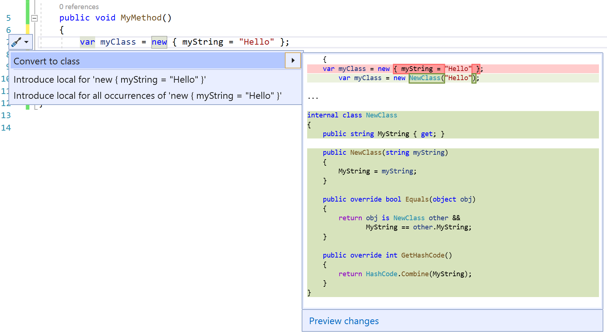
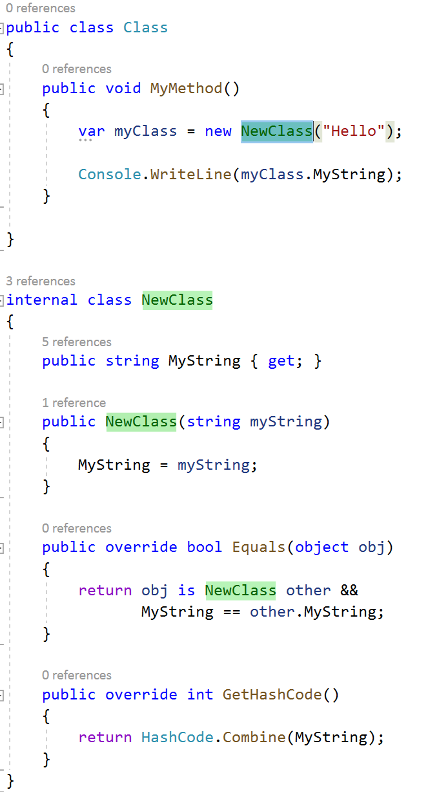

# Convert anonymous type to class

This refactoring applies to:

- C#

**What:** Convert an anonymous type to class.

**When:** You have an anonymous type that you want to continue to build on in a class.

**Why:** Anonymous types are useful if you're only using them locally. As your code grows, it's nice to have an easy way to promote them to a class.

## How-to

1. Place your cursor in an anonymous type.
2. Press **Ctrl**+**.** to trigger the **Quick Actions and Refactorings** menu.

   

2. Press **Enter** to accept the refactoring.

   

## See also

- [Refactoring](../refactoring-in-visual-studio.md)
