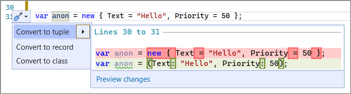

# Convert anonymous type to tuple

This refactoring applies to:

- C#

- Visual Basic

**What:** Convert an anonymous type to tuple.

**When:** You have an anonymous type that qualifies as a tuple.

**Why:** [Tuples](/dotnet/csharp/tuples) are helpful in keeping your syntax lightweight. This quick action makes it easier to take advantage of this C# feature.

## How-to

1. Place your cursor in an anonymous type.
2. Press **Ctrl**+**.** to trigger the **Quick Actions and Refactorings** menu.

   

2. Press **Enter** to accept the refactoring.

   

## See also

- [Refactoring](../refactoring-in-visual-studio.md)
