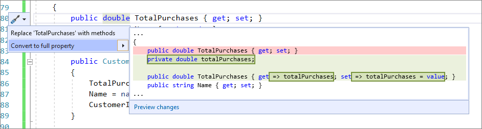
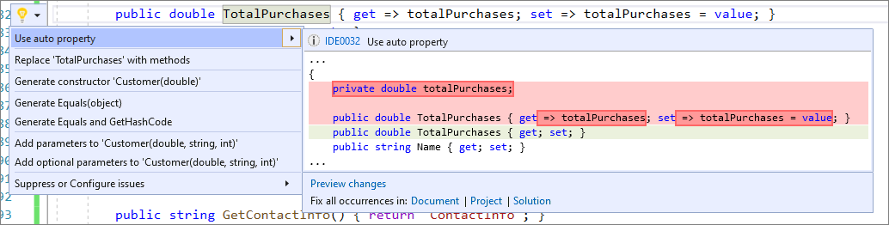

# Convert between auto property and full property

This refactoring applies to:

- C#

**What:** Convert between an auto-implemented property to a full property.

**When:** The logic of the property has changed.

**Why:** You can convert between an auto-implemented property to a full property manually, however this feature will automatically do the work for you. 

## How-to

1. Place your cursor on the property name.
2. Press **Ctrl**+**.** to trigger the **Quick Actions and Refactorings** menu.
3. Select from the following two options: 

    Select **Convert to full property**.

    

    Select **Use auto property**. 

    

## See also

- [Refactoring](../refactoring-in-visual-studio.md)
