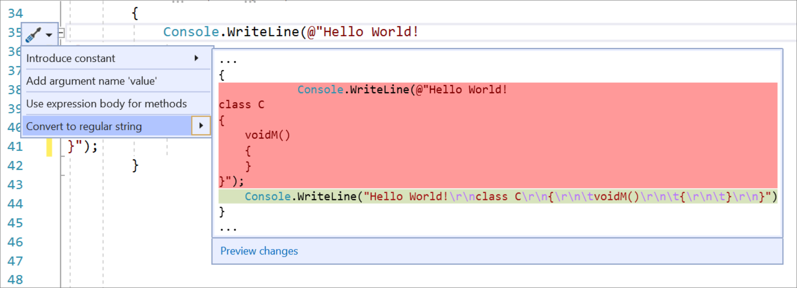
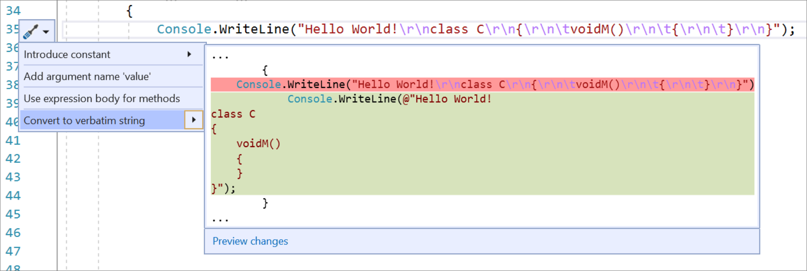

# Convert between regular string and verbatim string literals refactoring

This refactoring applies to:

- C#

**What:** Lets you convert between regular string and verbatim string literals.

**When:** You either want to save space or provide more clarity in your code.

**Why:** Converting a verbatim string literal to a regular string literal can help save space. Converting a regular string literal to a verbatim string literal can provide more clarity.

## How-to

1. Place your caret on either the regular string or verbatim string literal:

2. Press **Ctrl**+**.** to trigger the **Quick Actions and Refactorings** menu.

3. Select from one of the following options:

    Select **Convert to regular string**.

    

    Select **Convert to verbatim string**.

    

## See also

- [Refactoring](../refactoring-in-visual-studio.md)