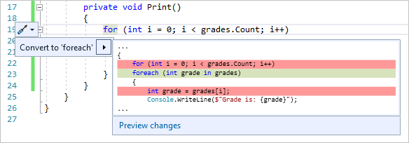
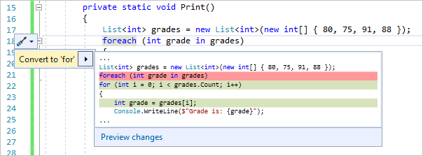

# Refactoring to convert between a for loop and a foreach statement

This article describes the Quick Actions refactorings that convert between two looping structures. It includes some reasons why you might want to switch between a [for](/dotnet/csharp/language-reference/keywords/for) loop and a [foreach](/dotnet/csharp/language-reference/keywords/foreach-in) statement in your code.

## Convert a for loop to a foreach statement

If you have a [for](/dotnet/csharp/language-reference/keywords/for) loop in your code, you can use this refactoring to convert it to a [foreach](/dotnet/csharp/language-reference/keywords/foreach-in) statement.

This refactoring applies to:

- C#

- Visual Basic

> [!NOTE]
> The **Convert to foreach** Quick Action refactoring is only available for [for](/dotnet/csharp/language-reference/keywords/for) loops that contain all three parts: an initializer, condition, and iterator.

### Why convert

Reasons you might want to convert a [for](/dotnet/csharp/language-reference/keywords/for) loop to a [foreach](/dotnet/csharp/language-reference/keywords/foreach-in) statement include:

- You don't use the local loop variable inside the loop except as an index to access items.

- You want to simplify your code and reduce the likelihood of logic errors in the initializer, condition, and iterator sections.

### How to use it

1. Place your caret in the `for` keyword.

1. Press **Ctrl**+**.** or click the screwdriver  icon in the margin of the code file.

   

1. Select **Convert to 'foreach'**. Or, select **Preview changes** to open the [Preview Changes](../../ide/preview-changes.md) dialog, and then select **Apply**.

## Convert a foreach statement to a for loop

If you have a [foreach (C#)](/dotnet/csharp/language-reference/keywords/foreach-in) or [For Each...Next (Visual Basic)](/dotnet/visual-basic/language-reference/statements/for-each-next-statement) statement in your code, you can use this refactoring to convert it to a [for](/dotnet/csharp/language-reference/keywords/for) loop.

This refactoring applies to:

- C#

- Visual Basic

### Why convert

Reasons you might want to convert a [foreach](/dotnet/csharp/language-reference/keywords/foreach-in) statement to a [for](/dotnet/csharp/language-reference/keywords/for) loop include:

- You want to use the local loop variable inside the loop for more than just accessing the item.

- You are [iterating through a multi-dimensional array](/dotnet/csharp/programming-guide/arrays/using-foreach-with-arrays) and you want more control over the array elements.

### How to use it

1. Place your caret in the `foreach` or `For Each` keyword.

1. Press **Ctrl**+**.** or click the screwdriver  icon in the margin of the code file.

   

1. Select **Convert to 'for'**. Or, select **Preview changes** to open the [Preview Changes](../../ide/preview-changes.md) dialog, and then select **Apply**.

1. Because the refactoring introduces a new iteration count variable, the **Rename** box appears at the top-right corner of the editor. If you want to choose a different name for the variable, type it in and then press **Enter** or select **Apply** in the **Rename** box. If you don't want to choose a new name, press **Esc** or select **Apply** to dismiss the **Rename** box.

> [!NOTE]
> For C#, the code generated by these refactorings uses either an explicit type or [var](/dotnet/csharp/language-reference/keywords/var) for the type of the items in the collection. The type in the generated code, explicit or implicit, depends on the code-style settings that are in scope. These particular code-style settings are configured at the machine level under **Tools** > **Options** > **Text Editor** > **C#** > **Code Style** > **General** > **\'var' preferences**, or at the solution level in an [EditorConfig](/dotnet/fundamentals/code-analysis/style-rules/language-rules#implicit-and-explicit-types) file. If you change a code-style setting in **Options**, reopen the code file for the changes to take effect.

## See also

- [Refactoring](../refactoring-in-visual-studio.md)
- [Preview Changes](../../ide/preview-changes.md)
