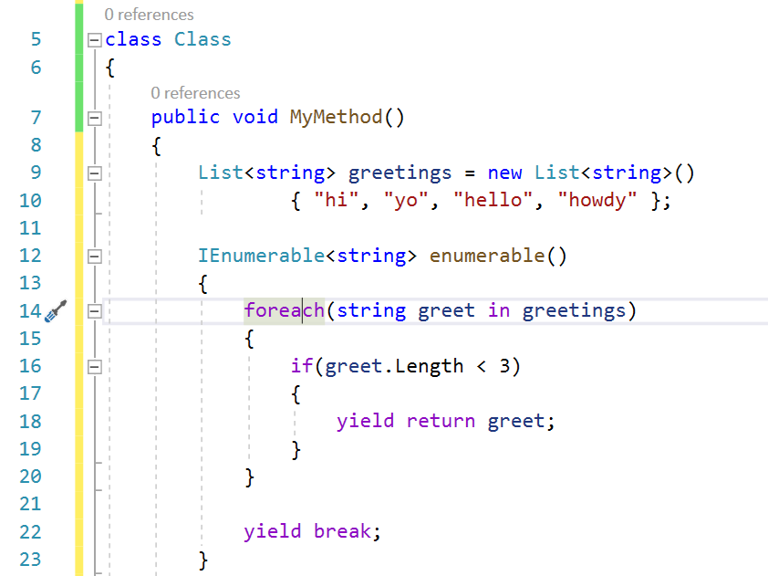
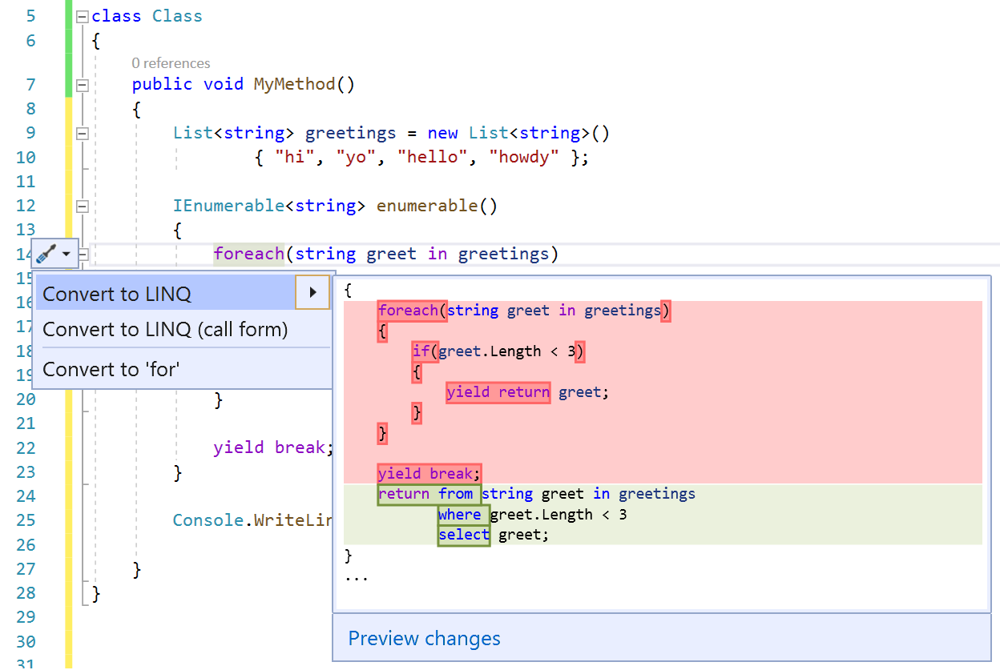
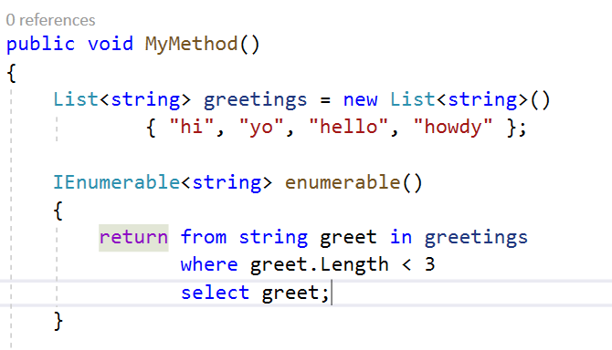
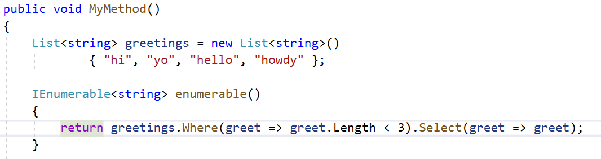

# Convert a foreach loop to LINQ

This refactoring applies to:

- C#

**What:** Lets you easily convert your *foreach* loop that uses an IEnumerable to a LINQ query or a LINQ call form (also known as a LINQ method).

**When:** You have a foreach loop that uses an IEnumerable, and you want that loop to read as a LINQ query.

**Why:** You prefer to use LINQ syntax rather than a foreach loop. [LINQ](/dotnet/csharp/programming-guide/concepts/linq/introduction-to-linq) makes a query into a first-class language construct in C#. LINQ can reduce the amount of code in a file, make the code easier to read, and allow different data sources to have similar query expression patterns.

> [!NOTE]
> LINQ syntax is typically less efficient than a foreach loop. It's good to be aware of any performance tradeoff that might occur when you use LINQ to improve the readability of your code.

## Convert a foreach loop to LINQ refactoring

1. Place your cursor in the `foreach` keyword.

    

2. Press **Ctrl**+**.** to trigger the **Quick Actions and Refactorings** menu.

   

3. Select **Convert to LINQ** or **Convert to Linq (call form)**.

   

   

### Sample code

```csharp
using System.Collections.Generic;

public class Class1
{
    public void MyMethod()
    {
        var greetings = new List<string>()
            { "hi", "yo", "hello", "howdy" };

        IEnumerable<string> enumerable()
        {
            foreach (var greet in greetings)
            {
                if (greet.Length < 3)
                {
                    yield return greet;
                }
            }

            yield break;
        }
    }
}
```

## See also

- [Refactoring](../refactoring-in-visual-studio.md)
- [Preview Changes window](../../ide/preview-changes.md)
- [Productivity features](../productivity-features.md)
