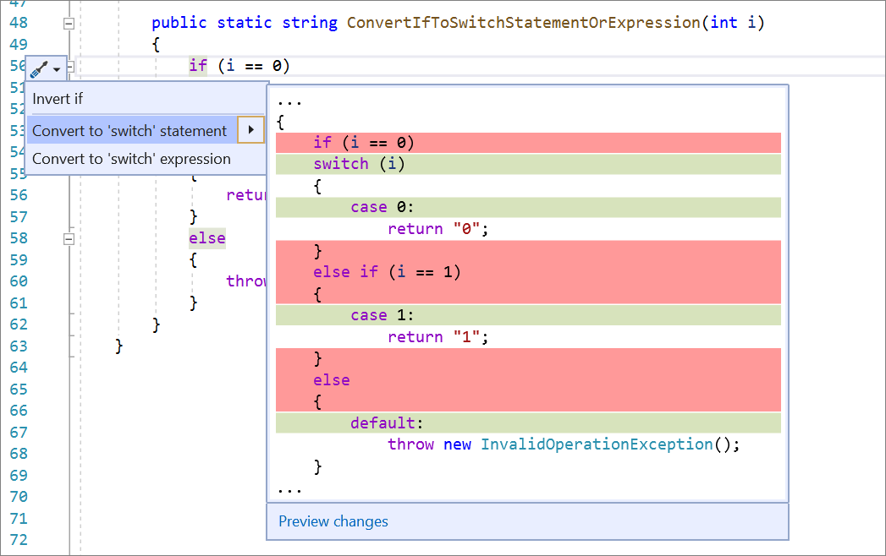
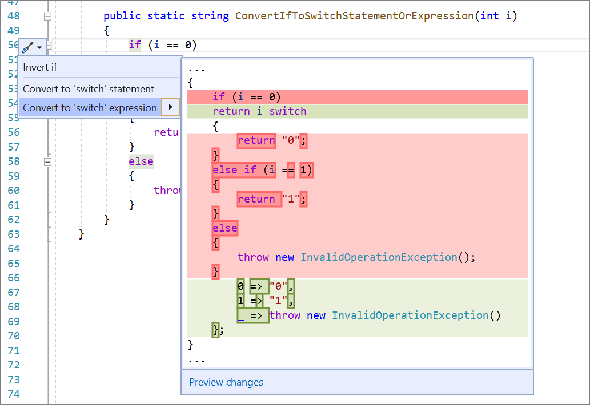

# Convert if statement to switch statement or switch expression

This refactoring applies to:

- C#

**What:** Convert an if statement to a [switch statement](/dotnet/csharp/language-reference/keywords/switch) or to the C# 8.0 [switch expression](/dotnet/csharp/whats-new/csharp-8#switch-expressions).

**When:** You want to convert an `if` statement to a `switch` statement or a `switch` expression and vice versa.

**Why:** If you are using an `if` statement, this refactoring enables an easy transition to `switch` statements or `switch` expressions.

## How-to

1. Place your cursor in the `if` keyword.
2. Press **Ctrl**+**.** to trigger the **Quick Actions and Refactorings** menu.
3. Select from the following two options:

    Select **Convert to 'switch' statement**.

   

    Select **Convert to 'switch' expression**.

    

## See also

- [Refactoring](../refactoring-in-visual-studio.md)
