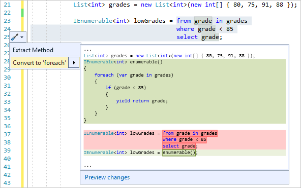

# Refactoring to convert LINQ to a foreach statement

Use this refactoring to convert [LINQ query syntax](/dotnet/csharp/programming-guide/concepts/linq/query-syntax-and-method-syntax-in-linq) to a [foreach](/dotnet/csharp/language-reference/keywords/foreach-in) statement.

This refactoring applies to:

- C#

- Visual Basic

## How to use it

1. Select the entire LINQ query starting with `from`.

   > [!NOTE]
   > This refactoring can only be used to convert LINQ queries expressed with query syntax and not method syntax.

1. Press **Ctrl**+**.** or click the screwdriver  icon in the margin of the code file.

   

1. Select **Convert to 'foreach'**. Or, select **Preview changes** to open the [Preview Changes](../../ide/preview-changes.md) dialog, and then select **Apply**.

> [!NOTE]
> For C#, the code generated by these refactorings uses either an explicit type or [var](/dotnet/csharp/language-reference/keywords/var) for the iteration variable of the `foreach` loop. The type in the generated code, explicit or implicit, depends on the code-style settings that are in scope. These particular code-style settings are configured at the machine level under **Tools** > **Options** > **Text Editor** > **C#** > **Code Style** > **General** > **\'var' preferences**, or at the solution level in an [EditorConfig](/dotnet/fundamentals/code-analysis/style-rules/language-rules#implicit-and-explicit-types) file. If you change a code-style setting in **Options**, reopen the code file for the changes to take effect.

## See also

- [LINQ](/dotnet/standard/using-linq)
- [Refactoring](../refactoring-in-visual-studio.md)
- [Preview Changes](../../ide/preview-changes.md)
