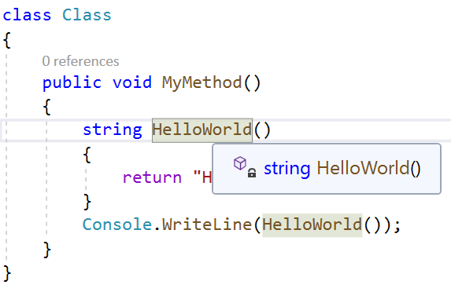
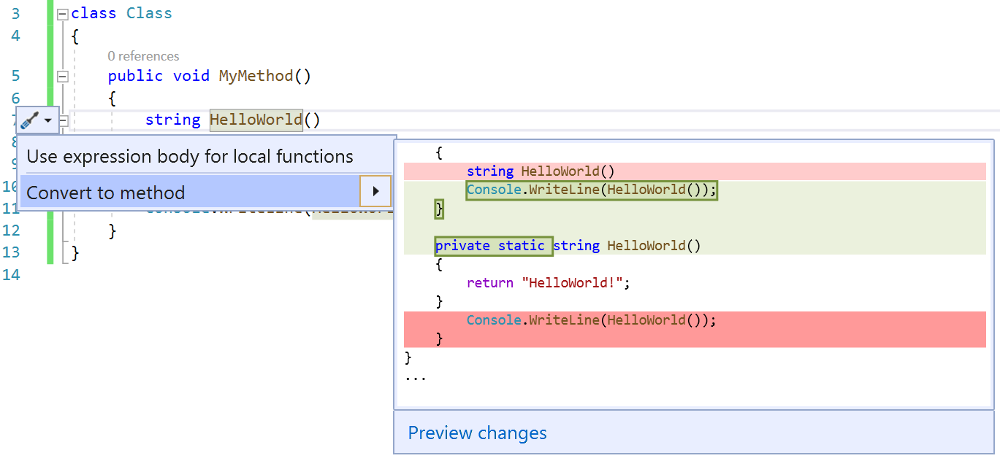
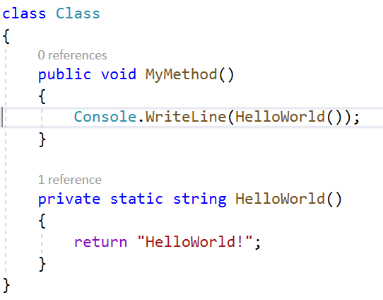

# Convert a local function to a method

This refactoring applies to:

- C#

**What:** Convert a local function to a method.

**When:** You have a local function that you want to define outside your current local context.

**Why:** You want to convert a local function into a method so that you can call it outside your local context. You might want to convert to a method when your local function is getting too long. When you define the function in a separate method, your code is easier to read.

## Convert local function to method refactoring

1. Place your cursor in the local function.

    

2. Press **Ctrl**+**.** to trigger the **Quick Actions and Refactorings** menu.

    

2. Press Enter to accept the refactoring.

    

## See also

- [Refactoring](../refactoring-in-visual-studio.md)
- [Productivity features](../productivity-features.md)
