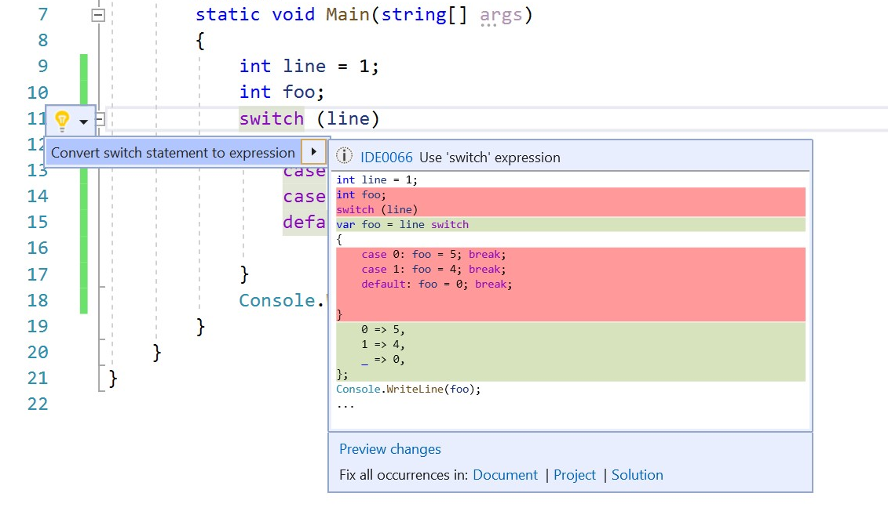

# Convert switch statement to switch expression

This refactoring applies to:

- C#

**What:** Convert a [switch statement](/dotnet/csharp/language-reference/keywords/switch) to a C# 8.0 [switch expression](/dotnet/csharp/whats-new/csharp-8#switch-expressions).

**When:** You want to convert a `switch` statement to a `switch` expression and vice versa. 

**Why:** If you are only using expressions, this refactoring enables an easy transition from traditional `switch` statements.

## How-to

1. In your project file, [set the language version to preview](/dotnet/csharp/language-reference/configure-language-version#edit-the-project-file) since `switch` expressions are a new C# 8.0 feature.
2. Place your cursor in the `switch` keyword and press **Ctrl**+**.** to trigger the **Quick Actions and Refactorings** menu.
3. Select **Convert switch statement to expression**.

   

## See also

- [Refactoring](../refactoring-in-visual-studio.md)
