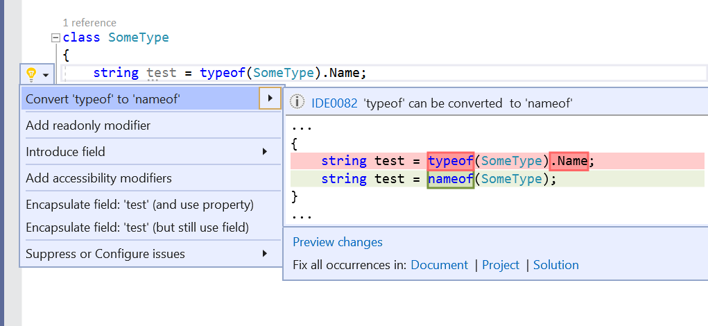
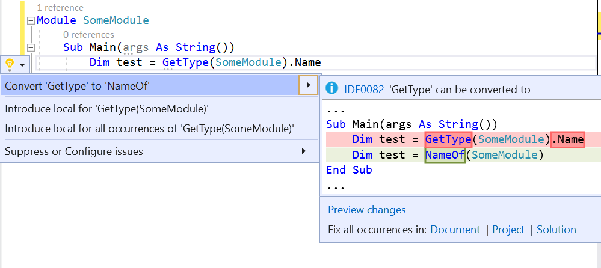

# Convert typeof(someType).Name instances to nameof(someType)

This refactoring applies to:

- C#
- Visual Basic

**What:** Refactoring of instances of typeof(someType).Name to nameof(someType) in C# and instances of GetType(someType).Name to NameOf(someType) in Visual Basic.

**When:**  All instances of typeof(someType).Name or GetType(someType).Name where someType isn't a generic type. This is because if someType is generic then these two cases don't return the same string value. 

**Why:** Using nameof rather than the name of the type avoids the reflection involved with retrieving a Type object, and is a more pragmatic way of writing it.

## How-to

1. Place your cursor somewhere within the typeof(someType).Name instance in visual studio.
2. Press **Ctrl**+**.** to trigger the **Quick Actions and Refactorings** menu.
3. Select **Convert typeof to nameof** or **Convert GetType to NameOf**

   

   

## See also

- [Refactoring](../refactoring-in-visual-studio.md)
