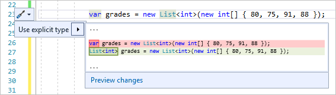

# Refactoring to replace var with an explicit type

Use this refactoring to replace [var](/dotnet/csharp/language-reference/keywords/var) in a local variable declaration with an explicit type.

This refactoring applies to:

- C#

## Why to use an explicit type

Following are some reasons to declare a variable with an explicit type:

- To improve the code's readability.

- When you don't want to initialize the variable in the declaration.

However, [var](/dotnet/csharp/language-reference/keywords/var) must be used when a variable is initialized with an anonymous type and the properties of the object are accessed at a later point. For more information, see [Implicitly typed local variables (C#)](/dotnet/csharp/programming-guide/classes-and-structs/implicitly-typed-local-variables).

## How to use it

1. Place the caret on the `var` keyword.

1. Press **Ctrl**+**.** or click the screwdriver  icon in the margin of the code file.

   

1. Select **Use explicit type**. Or, select **Preview changes** to open the [Preview Changes](../../ide/preview-changes.md) dialog, and then select **Apply**.

## See also

- [Implicitly typed variables (C#)](/dotnet/csharp/programming-guide/classes-and-structs/implicitly-typed-local-variables)
- [Refactoring](../refactoring-in-visual-studio.md)
- [Preview Changes](../../ide/preview-changes.md)
