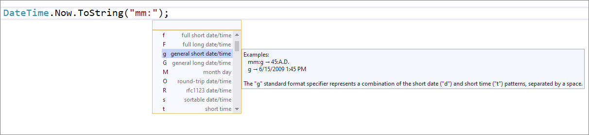

# DateTime and TimeSpan completion by using the IntelliSense menu

This refactoring applies to:

- C#

**What:** DateTime and TimeSpan string literal and format string completion through IntelliSense menu.

**When:** You want to write a DateTime and TimeSpan string literal and format string. IntelliSense gives you basic completion and an explanation as to what each of the characters mean.

**Why:** Remembering DateTime formats is hard and IntelliSense can help you write it.

## How-to

1. Place your cursor in the DateTime or TimeSpan format string.
2. Press **Ctrl**+**Space** to trigger the **IntelliSense** menu.
3. Select the character you would like to add.

   

## See also

- [Refactoring](../refactoring-in-visual-studio.md)
