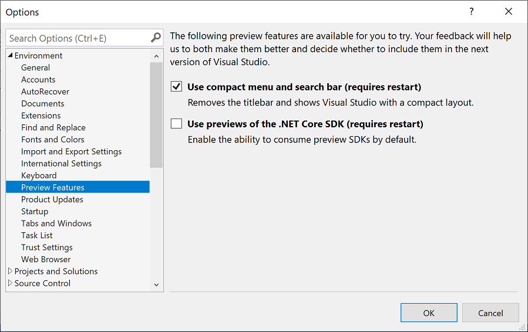

# Options dialog box: Environment \> Preview Features

Use this page of the **Options** dialog box to enable or disable preview features in Visual Studio. The **Preview Features** options page changes frequently as different preview features are made available in Visual Studio.

You can access this dialog box by clicking **Options** on the **Tools** menu and then selecting the **Environment** > **Preview Features** page. Or, enter **preview features** into the Visual Studio **Search** box (press **Ctrl**+**Q** to move focus to the **Search** box).
