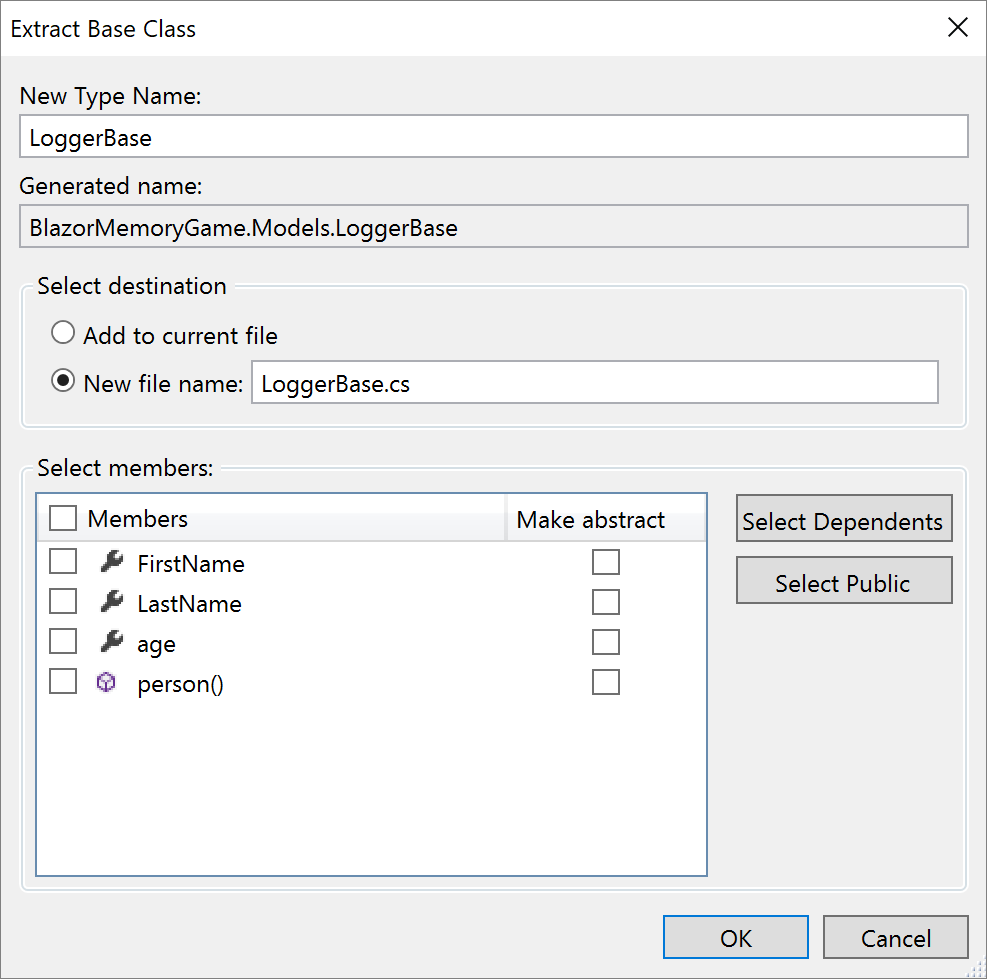

# Extract base class

This refactoring applies to:

- C#

- Visual Basic

**What:** Extract base class.

**When:** You want to extract members from a selected class to a new base class.

**Why:** Pulling members up manually can be time consuming and take you out of your workflow. 

## How-to

1. Place your caret on either the class name or a highlighted member.

2. Press **Ctrl**+**.** to trigger the **Quick Actions and Refactorings** menu.

3. Select **Pull member(s) up to new base class**.

    

The new **Extract Base Class** dialog will open where you can specify the name for the base class and location of where it should be placed. You can select the members that you want to transfer to the new base class and choose to make the members abstract by selecting the checkbox in the Make abstract column.

## See also

- [Refactoring](../refactoring-in-visual-studio.md)
