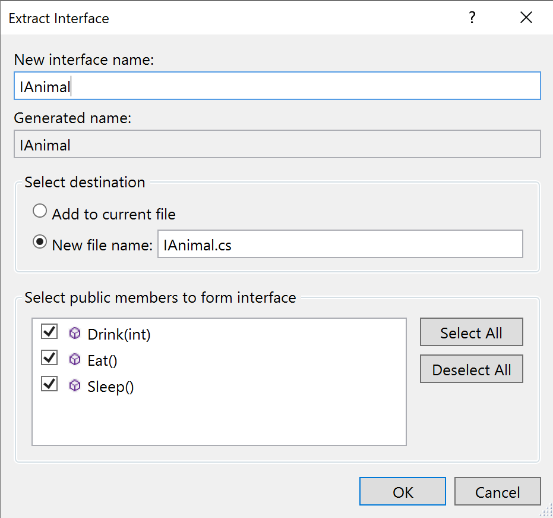
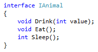
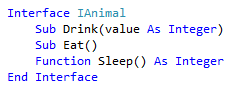

# Extract an interface refactoring

This refactoring applies to:

- C#

- Visual Basic

**What:** Lets you create an interface using existing members from a class, struct, or interface.

**When:** You have members in a class, struct, or interface that could be inherited by other classes, structs, or interfaces.

**Why:** Interfaces are great constructs for object-oriented designs. Imagine having classes for various animals (Dog, Cat, Bird) which might all have common methods, such as Eat, Drink, Sleep. Using an interface like IAnimal would allow Dog, Cat, and Bird to have a common "signature" for these methods.

## Extract an interface refactoring

1. Place your cursor in the class name.

   - C#:

       

   - Visual Basic:

       

2. Next, do one of the following actions:

   - **Keyboard**
      - Press **Ctrl+R**, then **Ctrl+I**. (Your keyboard shortcut may be different based on which profile you've selected.)
      - Press **Ctrl**+**.** to trigger the **Quick Actions and Refactorings** menu and select **Extract Interface** from the Preview window popup.
   - **Mouse**
      - Select **Edit > Refactor > Extract Interface**.
      - Right-click the name of the class, select the **Quick Actions and Refactorings** menu and select **Extract Interface** from the Preview window popup.

3. In the **Extract Interface** dialog box that pops up, enter the information asked:

   

   | Field | Description |
   | - | - |
   | **New interface name** | The name of the interface to be created. The name will default to I*ClassName*, where *ClassName* is the name of the class you selected above. |
   | **New file name** | The name of the generated file that will contain the interface. As with the interface name, this name will default to I*ClassName*, where *ClassName* is the name of the class you selected above. You can also select the option to **Add to current file**. |
   | **Select public members to form interface** | The items to extract into the interface. You may select as many as you wish. |

4. Choose **OK**.

   The interface is created in the file of the name specified. Additionally, the class you selected implements that interface.

   - C#:

      

      

   - Visual Basic:

      

      

## See also

- [Refactoring](../refactoring-in-visual-studio.md)
- [Productivity features](../productivity-features.md)
