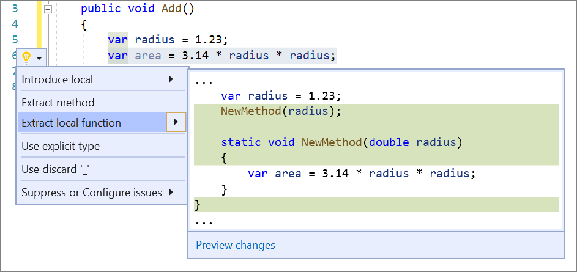

# Extract local function refactoring

This refactoring applies to:

- C#

**What:** Lets you turn a fragment of code from an existing method into a local function.

**When:** You have a fragment of existing code in some method that needs to be called from a local function.

**Why:** You could copy/paste that code, but that would lead to duplication. A better solution is to refactor that fragment into its own local function.

## How-to

1. Highlight the code to be extracted.

2. Press **Ctrl**+**.** to trigger the **Quick Actions and Refactorings** menu. 

3. Select **Extract local function**.

    

## See also

- [Refactoring](../refactoring-in-visual-studio.md)
- [Preview Changes](../../ide/preview-changes.md)
