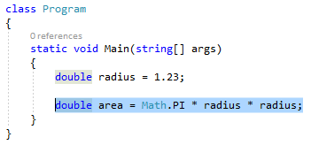
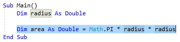

# Extract a method refactoring

This refactoring applies to:

- C#

- Visual Basic

**What:** Lets you turn a fragment of code into its own method.

**When:** You have a fragment of existing code in some method that needs to be called from another method.

**Why:** You could copy/paste that code, but that would lead to duplication. A better solution is to refactor that fragment into its own method which can be called freely by any other method.

## How-to

1. Highlight the code to be extracted:

   - C#:

       

   - Visual Basic:

       

2. Next, do one of the following:

   - **Keyboard**
      - Press **Ctrl+R**, then **Ctrl+M**. (Note that your keyboard shortcut may be different based on which profile you've selected.)
      - Press **Ctrl**+**.** to trigger the **Quick Actions and Refactorings** menu and select **Extract Method** from the Preview window popup.
   - **Mouse**
      - Select **Edit > Refactor > Extract Method**.
      - Right-click the code and select **Refactor > Extract > Extract Method**.
      - Right-click the code, select the **Quick Actions and Refactorings** menu and select **Extract Method** from the Preview window popup.

   The method will be immediately created. From here, you can now rename the method simply by typing the new name.

   > [!TIP]
   > You can also update comments and other strings to use this new name, as well as [preview changes](../../ide/preview-changes.md) before saving, using the checkboxes in the **Rename** box that appears at the top right of your IDE.

   - C#:

      

   - Visual Basic:

      

3. When you're happy with the change, choose the **Apply** button or press **Enter** and the changes will be committed.

## See also

- [Refactoring](../refactoring-in-visual-studio.md)
- [Preview Changes](../../ide/preview-changes.md)