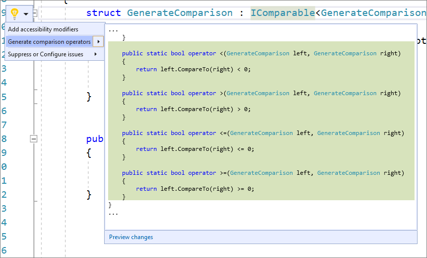

# Generate Comparison Operators for types that implement IComparable

This code generation applies to:

- C#

**What:** Lets you generate **Comparison** operators for types that implement IComparable.

**When:** You have a type that implements IComparable we will automatically add the comparison operators.

**Why:** If you are implementing a value type, you should consider overriding the **Equals** method to gain increased performance over the default implementation of the Equals method on ValueType.

## How-to

1. Place your cursor either inside the class or on the IComparable keyword.

2. Next, do one of the following:

   - Press **Ctrl**+**.** to trigger the **Quick Actions and Refactorings** menu.

   - Right-click and select the **Quick Actions and Refactorings** menu.

   - Click the  icon that appears in the left margin.

   

3. Select **Generate Equals(object)** from the drop-down menu.

## See also

- [Code Generation](../code-generation-in-visual-studio.md)
- [Preview Changes](../../ide/preview-changes.md)
