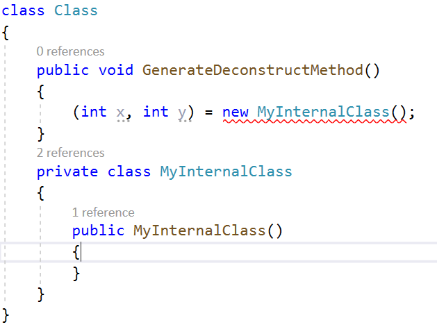
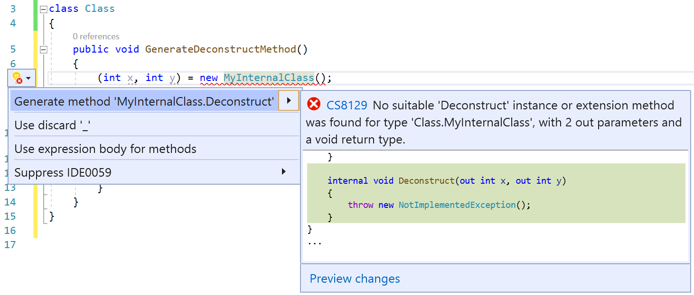
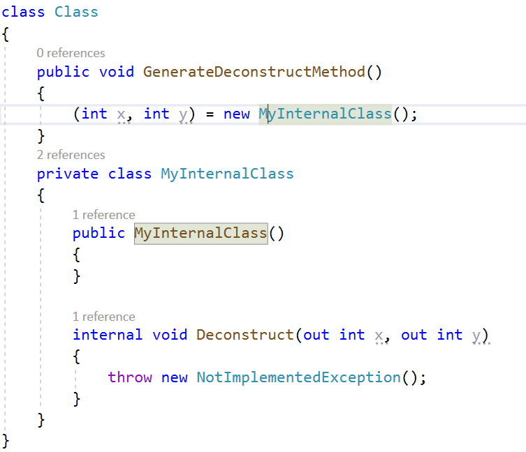

# Generate a deconstructor in Visual Studio

This code generation applies to:

- C#

**What:** Lets you immediately generate the method stub for a new deconstructor.

**When:** You want to properly deconstruct your type automatically.

**Why:** You can manually type a deconstructor, but this feature generates the stub for you with the correct out parameters.

## Generate a deconstructor

1. Declare a new type with the desired out parameters specified. This declaration will cause an error when no deconstruct instance matching your declaration can be found.

   

2. Take one of the following steps:

   - **Keyboard**
      - With the cursor in your declaration, select Ctrl+. to trigger the **Quick Actions and Refactorings** menu.
   - **Mouse**
      - Right-click and select the **Quick Actions and Refactorings** menu.
      - Select the :::image type="icon" source="media/screwdriver.png"::: icon that appears in the left margin if the text cursor is already on the empty line in the class.

      

3. Select **Generate method 'MyInternalClass.Deconstruct'** to generate the deconstructor.

   

## See also

- [Code generation](../code-generation-in-visual-studio.md)
- [Preview changes](../../ide/preview-changes.md)
- [Productivity features](../productivity-features.md)
