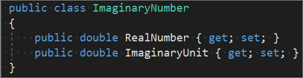
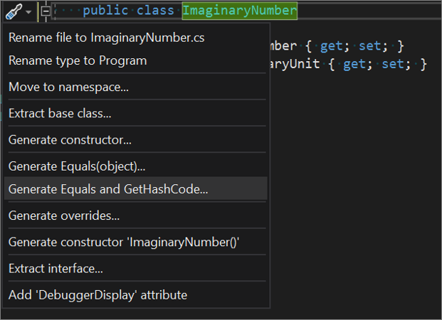
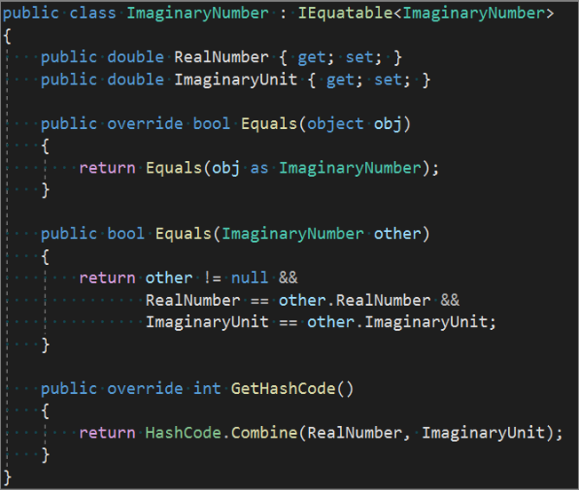

# Generate Equals and GetHashCode method overrides in Visual Studio

This code generation applies to:

- C#

**What:** Lets you generate **Equals** and **GetHashCode** methods.

**When:** Generate these overrides when you have a type that should be compared by one or more fields, instead of by object location in memory.

**Why:**

- If you're implementing a value type, you should consider overriding the **Equals** method. You can gain increased performance over the default implementation of the Equals method on ValueType when you do so.

- If you're implementing a reference type, you should consider overriding the **Equals** method if your type looks like a base type, such as Point, String, BigNumber, and so on.

- Override the **GetHashCode** method to allow a type to work correctly in a hash table. Read more guidance on [equality operators](/dotnet/standard/design-guidelines/equality-operators).

## How-to

1. Place your cursor somewhere on the line of your type declaration.

    ```csharp
    public class ImaginaryNumber
    {
        public double RealNumber { get; set; }
        public double ImaginaryUnit { get; set; }
    }
    ```

   Your code should look similar to the following screenshot:

   

   > [!TIP]
   > Do not double-click select the type name, or the menu option won't be available. Just place the cursor somewhere on the line.

1. Next, choose one of the following actions:

   - Press **Ctrl**+**.** to trigger the **Quick Actions and Refactorings** menu.

   - Right-click and select the **Quick Actions and Refactorings** menu.

   - Click the  icon that appears in the left margin.

1. In the drop-down menu, select **Generate Equals(object)** or **Generate Equals and GetHashCode**.

   

1. In the **Pick members** dialog box, select the members you want to generate the methods for:

    

    > [!TIP]
    > You can also choose to generate operators from this dialog by using the checkbox near the bottom of the dialog.

   The `Equals` and `GetHashCode` methods are generated with default implementations, as shown in the following code:

    ```csharp
   public class ImaginaryNumber : IEquatable<ImaginaryNumber>
    {
        public double RealNumber { get; set; }
        public double ImaginaryUnit { get; set; }

        public override bool Equals(object obj)
        {
            return Equals(obj as ImaginaryNumber);
        }

        public bool Equals(ImaginaryNumber other)
        {
            return other != null &&
                   RealNumber == other.RealNumber &&
                   ImaginaryUnit == other.ImaginaryUnit;
        }

        public override int GetHashCode()
        {
            return HashCode.Combine(RealNumber, ImaginaryUnit);
        }
    }
    ```

   Your code should look similar to the following screenshot:

   

## See also

- [Code Generation](../code-generation-in-visual-studio.md)
- [Preview Changes](../../ide/preview-changes.md)
