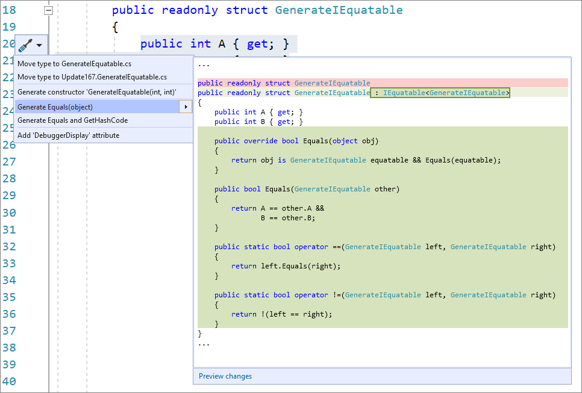

# Generate IEquatable operators when generating Equals for structs

This code generation applies to:

- C#

**What:** Lets you generate **Equals** and **IEquatable** operators for [structs](/dotnet/csharp/language-reference/builtin-types/struct).

**When:** You have a struct we will automatically add the IEquatable as well as the equals and not equals operators for you.

**Why:**

- If you are implementing a value type, you should consider overriding the **Equals** method to gain increased performance over the default implementation of the Equals method on ValueType.

- Implement IEquatable interface implements a type-specific Equals() method.

## How-to

1. Place your cursor somewhere on the line of your struct declaration.

2. Next, do one of the following:

   - Press **Ctrl**+**.** to trigger the **Quick Actions and Refactorings** menu.

   - Right-click and select the **Quick Actions and Refactorings** menu.

   - Click the  icon that appears in the left margin.

   

3. Select **Generate Equals(object)** from the drop-down menu.

## See also

- [Code Generation](../code-generation-in-visual-studio.md)
- [Preview Changes](../../ide/preview-changes.md)