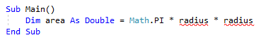
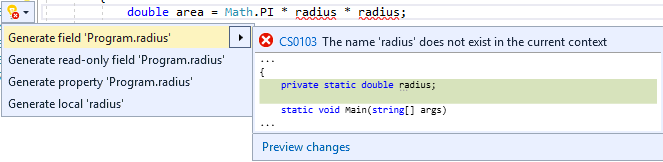
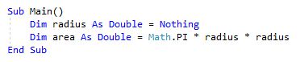

# Generate a field, property, or local variable in Visual Studio

This code generation applies to:

- C#

- Visual Basic

**What:** Lets you immediately generate the code for a previously undeclared field, property, or local.

**When:** You introduce a new field, property or local while typing and want to properly declare it, automatically.

**Why:** You could declare the field, property or local before using it, however this feature will generate the declaration and type automatically.

## How-to

1. Place your cursor on the line where there is a red squiggle. The red squiggle indicates a field, local or property that doesn't yet exist.

   - C#:

       

   - Visual Basic:

       

2. Next, do one of the following:

   - **Keyboard**
      - Press **Ctrl**+**.** to trigger the **Quick Actions and Refactorings** menu.
   - **Mouse**
      - Right-click and select the **Quick Actions and Refactorings** menu.
      - Hover over the red squiggle and click the  icon that appears.
      - Click the  icon that appears in the left margin if the text cursor is already on the line with the red squiggle.

      

3. Select one of the generation options from the drop-down menu.

   > [!TIP]
   > Use the **Preview changes** link at the bottom of the preview window [to see all of the changes](../../ide/preview-changes.md) that will be made before making your selection.

   The field, property or local is created, with the type inferred from its usage.

   - C#:

       

   - Visual Basic:

       

## See also

- [Code Generation](../code-generation-in-visual-studio.md)
- [Preview Changes](../../ide/preview-changes.md)
