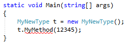
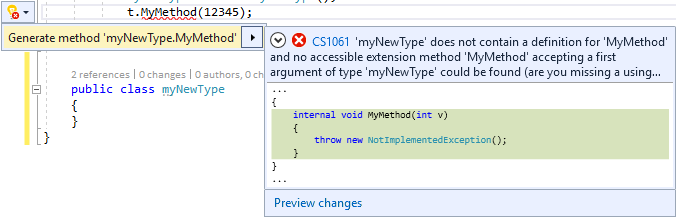
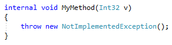
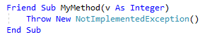

# Generate a method in Visual Studio

This code generation applies to:

- C#

- Visual Basic

**What:** Lets you immediately add a method to a class.

**When:** You introduce a new method and want to properly declare it, automatically.

**Why:** You could declare the method and parameters before using it, however this feature will generate the declaration automatically.

## How-to

1. Place your cursor on the line where there is a red squiggle. The red squiggle indicates a method that doesn't exist yet.

   - C#:

       

   - Visual Basic:

       

2. Next, do one of the following:

   - **Keyboard**
      - Press **Ctrl**+**.** to trigger the **Quick Actions and Refactorings** menu.
   - **Mouse**
      - Right-click and select the **Quick Actions and Refactorings** menu.
      - Hover over the red squiggle and click the  icon that appears.
      - Click the  icon that appears in the left margin if the text cursor is already on the line with the red squiggle.

      

3. Select **Generate method** from the drop-down menu.

   > [!TIP]
   > Use the **Preview changes** link at the bottom of the preview window [to see all of the changes](../../ide/preview-changes.md) that will be made before making your selection.

   The method is created with any parameters inferred from its usage.

   - C#:

       

   - Visual Basic:

       

## See also

- [Code Generation](../code-generation-in-visual-studio.md)
- [Preview Changes](../../ide/preview-changes.md)
