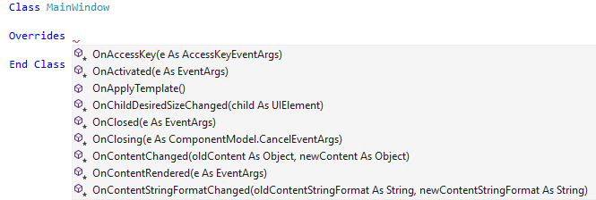
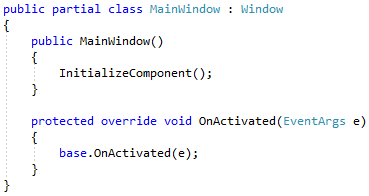

# Generate an override in Visual Studio

This code generation applies to:

- C#

- Visual Basic

**What:** Lets you immediately generate the code for any method which can be overridden from a base class.

**When:** You want to override a base class method and generate the signature automatically.

**Why:** You could write the method signature yourself, however this feature will generate the signature automatically.

## How-to

1. Type `override` in C# or `Overrides` in Visual Basic, followed by a space, where you would like to insert an override method.

   - C#:

      

   - Visual Basic:

      

2. Select the method you want to override from the base class.

   > [!TIP]
   > - Use the property icon  to show or hide properties in the list.
   > - Use the method icon  to show or hide methods in the list.

   The selected method or property is added to the class as an override, ready to be implemented.

   - C#:

       

   - Visual Basic:

       

## See also

- [Code Generation](../code-generation-in-visual-studio.md)
