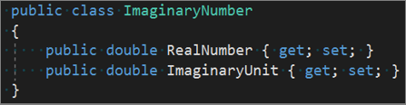
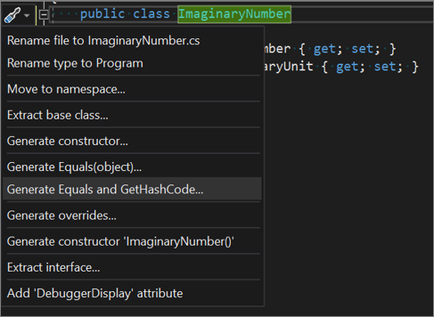
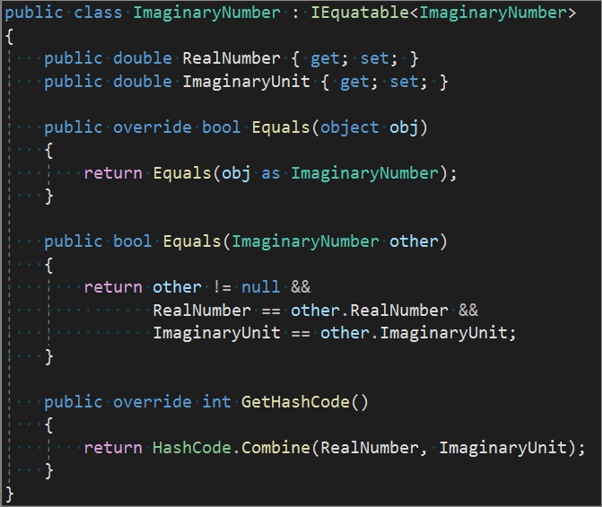

# Generate Equals and GetHashCode method overrides in C# #

**What:** Lets you generate **Equals** and **GetHashCode** methods.

**When:** Generate these overrides when you have a type that represents a "value" that should be compared by some fields, instead of by object location in memory.

**Why:** If you are implementing a value type, you should consider overriding the Equals method to gain increased performance over the default implementation of the Equals method on ValueType.

If you are implementing a reference type, you should consider overriding the Equals method if your type looks like a base type, such as Point, String, BigNumber, and so on.

Override the GetHashCode method to allow a type to work correctly in a hash table. Read more guidance on [equality operators](/dotnet/standard/design-guidelines/equality-operators).

**How:**

1. Place your cursor in your type declaration.

   

1. Next, do one of the following:
   * **Keyboard**
     * Press **Ctrl+.** to trigger the **Quick Actions and Refactorings** menu and select **Generate Equals(object)** or **Generate Equals and GetHashCode** from the Preview window popup.
   * **Mouse**
     * Right-click and select the **Quick Actions and Refactorings** menu and select **Generate Equals(object)** or **Generate Equals and GetHashCode** from the Preview window popup.
     * Click the  icon which appears in the left margin if the text cursor is already on the line with the type declaration.

   

1. Pick which members you want to generate the overrides methods for:

    

    > [!TIP]
    > You can also choose to generate operators from this dialog by using the checkboxes underneath the members list.

1. The Equals and GetHashCode overrides will be generated with automatic default implementations.

   

## See also

[Code Generation](../code-generation-in-visual-studio.md)  
[Preview Changes](../../ide/preview-changes.md)
