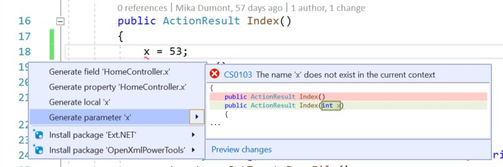

# Generate parameter

This refactoring applies to:

- C#

**What:** Automatically generates a method parameter.

**When:** You reference a variable in a method that doesn't exist in the current context and receive an error; you can generate a parameter as a code fix. 

**Why:** You can quickly modify a method signature without losing context.

## How-to

1. Place your cursor in the variable name and press **Ctrl**+**.** to trigger the **Quick Actions and Refactorings** menu.
1. Select **Generate parameter**.

    

## See also

- [Refactoring](../refactoring-in-visual-studio.md)
