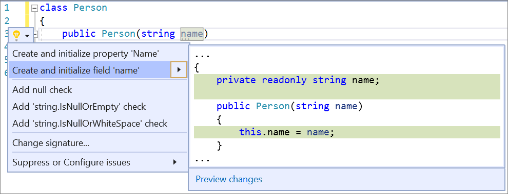

--- 
title: Generate private field and property from constructor
description: Learn how to use the Quick Actions and Refactorings menu to generate a private field or property from a constructor.
ms.date: 06/20/2020 
ms.topic: reference 
ms.custom: "ide-ref"
author: mikadumont
ms.author: midumont
manager: mijacobs 
dev_langs: 
  - CSharp 
  - VB
--- 
# Generate private field and property from constructor

This refactoring applies to: 

- C# 

**What:** Generate a private field or property from a constructor. 

**When:** You want to quickly add and initialize a private field or property from a constructor.

**Why:** Writing private fields and properties can be time consuming and repetitive. Using this refactoring is quick and makes the program more robust.

## How-to 

1. Place your cursor on the parameter name within the constructor.

2. Press **Ctrl**+**.** to trigger the **Quick Actions and Refactorings** menu.
   
3. Next, select from one of the following:

- **Create and initialize field** or **Create and initialize property**.

   

## See also 

- [Refactoring](../refactoring-in-visual-studio.md)
