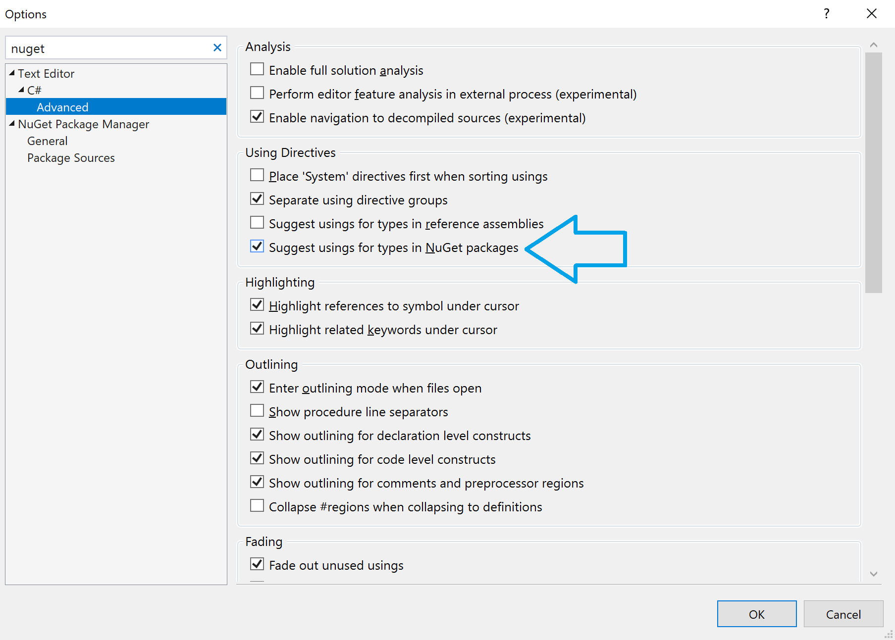

# Generate usings in Visual Studio

This code generation applies to:

- C#

- Visual Basic

**What:** Lets you immediately add the necessary imports or "usings statements" of copy and pasted code.

**When:** It is common practice to copy and paste code from different places in your project or other code sources. This quick action detects what imports are needed by analyzing the code and prompts you to add them after you copy and paste.

**Why:** By automatically adding necessary imports the user does not need to go back to the file they were copying from to copy the needed using statements.

## How-to

1. Copy and paste code from a different file without including the necessary using statements. The error is now accompanied by a codefix that adds the missing using statements.

    > [!NOTE] This suggestion needs to be turned on in **Tools > Options > Text Editor > C# > Advanced > Using Directives**
    > 

2. Press **Ctrl**+**.** to open the **Quick Actions and Refactorings** menu. 

    

3. Select **using \<your reference\>;** to add the missing reference.

    

## See also

- [Code Generation](../code-generation-in-visual-studio.md)
- [Preview Changes](../../ide/preview-changes.md)