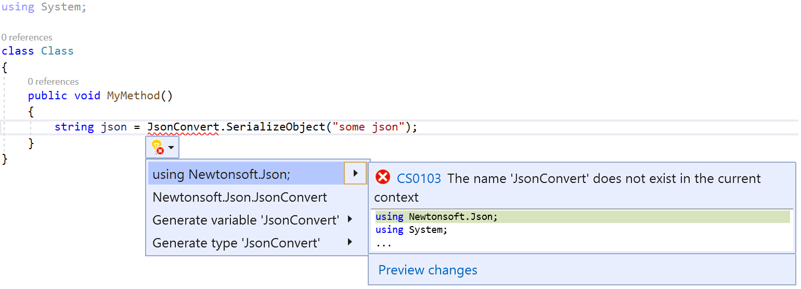
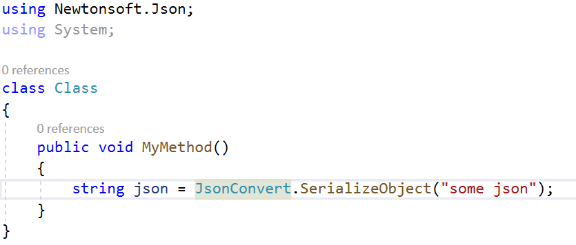

# Add missing usings in Visual Studio

This code generation applies to:

- C#

- Visual Basic

**What:** Lets you immediately add the necessary imports or [using directives](/dotnet/csharp/language-reference/keywords/using-directive) for copy-and-pasted code.

**When:** It's common practice to copy code from different places in your project or other sources and paste it in to new code. This Quick Action finds missing imports directives for copy-and-pasted code and then prompts you to add them. This code fix can also add references from project to project.

**Why:** Because the Quick Action automatically adds necessary imports, you don't need to manually copy the `using` directives that your code needs.

## Add missing usings refactoring

1. Copy code from a file and paste it into a new one without including the necessary `using` directives. The resulting error is accompanied by a code fix that adds the missing `using` directives.

    > [!NOTE]
    > You need to enable this suggestion in **Tools > Options > Text Editor > C# > Advanced > Using Directives**.

2. Select Ctrl+. to open the **Quick Actions and Refactorings** menu.

    

3. Select **using \<your reference\>;** to add the missing reference.

    

## See also

- [Code generation](../code-generation-in-visual-studio.md)
- [Preview Changes](../../ide/preview-changes.md)
- [Productivity features](../productivity-features.md)
