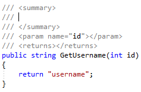
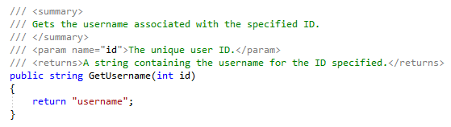

# How to: Insert XML comments for documentation generation

Visual Studio can help you document code elements such as classes and methods, by automatically generating the standard XML documentation comment structure. At compile time, you can generate an XML file that contains the documentation comments.

> [!TIP]
> For information about configuring the name and location of the generated XML file, see [Documenting your code with XML comments (C# Guide)](/dotnet/csharp/codedoc).

The compiler-generated XML file can be distributed alongside your .NET assembly so that Visual Studio and other IDEs can use IntelliSense to show quick information about types and members. Additionally, the XML file can be run through tools like [DocFX](https://dotnet.github.io/docfx/) and [Sandcastle](https://www.microsoft.com/download/details.aspx?id=10526) to generate API reference websites.

> [!NOTE]
> The **Insert Comment** command that automatically inserts XML documentation comments is available in [C#](/dotnet/csharp/programming-guide/xmldoc/xml-documentation-comments) and [Visual Basic](/dotnet/visual-basic/programming-guide/program-structure/how-to-create-xml-documentation). However, you can manually insert [XML documentation comments in C++](/cpp/build/reference/xml-documentation-visual-cpp) files and still generate XML documentation files at compile time.

## To insert XML comments for a code element

1. Place your text cursor above the element you want to document, for example, a method.

1. Do one of the following:

   - Type `///` in C#, or `'''` in Visual Basic

   - From the **Edit** menu, choose **IntelliSense** > **Insert Comment**

   - From the right-click or context menu on or just above the code element, choose **Snippet** > **Insert Comment**

   The XML template is immediately generated above the code element. For example, when commenting a method, it generates the **\<summary\>** element, a **\<param\>** element for each parameter, and a **\<returns\>** element to document the return value.

   

   

1. Enter descriptions for each XML element to fully document the code element.

   

> [!NOTE]
> There is an [option](../../ide/reference/options-text-editor-csharp-advanced.md) to toggle XML documentation comments after typing `///` in C# or `'''` Visual Basic. From the menu bar, choose **Tools** > **Options** to open the **Options** dialog box. Then, navigate to **Text Editor** > **C#** or **Basic** > **Advanced**. In the **Editor Help** section, look for the **Generate XML documentation comments** option.

## See also

- [XML documentation comments (C# Programming Guide)](/dotnet/csharp/programming-guide/xmldoc/xml-documentation-comments)
- [Documenting your code with XML comments (C# Guide)](/dotnet/csharp/codedoc)
- [How to: Create XML documentation (Visual Basic)](/dotnet/visual-basic/programming-guide/program-structure/how-to-create-xml-documentation)
- [C++ Comments](/cpp/cpp/comments-cpp)
- [XML Documentation (C++)](/cpp/build/reference/xml-documentation-visual-cpp)
- [Code generation](../code-generation-in-visual-studio.md)