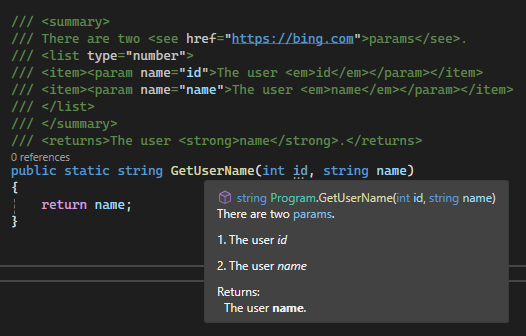

# Insert XML comments for documentation generation

This article describes how Visual Studio can help you document code elements such as classes and methods by automatically generating the standard XML documentation comment structure. At compile time, you can generate an XML file that contains the documentation comments.

You can distribute the compiler-generated XML file along with your .NET assembly so that Visual Studio and other IDEs can use IntelliSense to show quick information about types and members. You can also run the XML file through tools like [DocFX](https://dotnet.github.io/docfx/) and [Sandcastle](https://www.microsoft.com/download/details.aspx?id=10526) to generate API reference websites.

> [!NOTE]
> The **Insert Comment** command to automatically insert XML documentation comment structure is available in [C#](/dotnet/csharp/programming-guide/xmldoc/) and [Visual Basic](/dotnet/visual-basic/programming-guide/program-structure/how-to-create-xml-documentation). For C++, you can [manually insert XML documentation comments](/cpp/build/reference/xml-documentation-visual-cpp) and still generate XML documentation files at compile time.

## Enable documentation generation

   ::: moniker range=">= vs-2022"
To enable documentation generation, select the **Generate a file containing API documentation** checkbox on the **Build** > **Output** tab of your project's properties.

By default, a documentation file named the same as your assembly with an *.xml* file extension generates in the same directory as the assembly. If you want to configure a nondefault name or location for the  file, enter or browse to an alternate location under **XML documentation file path**.
   ::: moniker-end

   ::: moniker range="<= vs-2019"
To enable documentation generation, select the **XML documentation file** checkbox in the **Build** > **Output** section of your project's properties.

By default, a documentation file named the same as your assembly with an *.xml* file extension generates in the same directory as the assembly. If you want to configure a nondefault name or location for the  file, enter or browse to an alternate location.
   ::: moniker-end

Alternatively, you can add the [GenerateDocumentationFile](/dotnet/core/project-sdk/msbuild-props#generatedocumentationfile) or [DocumentationFile](/dotnet/core/project-sdk/msbuild-props#documentationfile) properties to your *.csproj*, *.vbproj*, or *.fsproj* file. Set `GenerateDocumentationFile` to `true` to generate a documentation file with the default name and location. Use the `DocumentationFile` property to specify a different name or location.

If you use `DocumentationFile` by itself or with the `GenerateDocumentationFile` property set to `true`, a documentation file with the specified name and location is generated. However, if you set `GenerateDocumentationFile` to `false`, no documentation file is generated even if you set the `DocumentationFile` property.

## Enable comment insertion keyboard shortcut

You can set the [Comments](options-text-editor-csharp-advanced.md#comments) option to automatically insert XML comment structures after you type `///` in C# or `'''` in Visual Basic.

1. From the Visual Studio menu bar, choose **Tools** > **Options**.
1. In the **Options** dialog box, navigate to **Text Editor** > **C#** (or **Visual Basic**) > **Advanced**.
1. Under the **Comments** section, select or deselect **Generate XML documentation comments for \\\\\\** (or **'''**).

## Automatically insert an XML comment

1. In Visual Studio, place your cursor above the element you want to document, for example a method.

1. Take one of the following actions:

   - If the automatic comment insertion shortcut is enabled, type `///` in C#, or `'''` in Visual Basic.
   - From the **Edit** menu, choose **IntelliSense** > **Insert Comment**.
   - From the right-click or context menu, choose **Snippet** > **Insert Comment**.

   The XML comment structure is immediately generated above the code element. For example, when commenting the following `GetUserName` method, the template generates the `<summary>` element, a `<param>` element for the parameter, and a `<returns>` element to document the return value.

    ```csharp
    /// <summary>
    /// 
    /// </summary>
    /// <param name="id"></param>
    /// <returns></returns>
    public string GetUserName(int id)
    {
        return "username";
    }
    ```

    ```vb
    ''' <summary>
    ''' 
    ''' </summary>
    ''' <param name="id"></param>
    ''' <returns></returns>
    Public Function GetUserName(id As Integer) As String
        Return "username"
    End Function
    ```

1. Enter descriptions for each XML element to fully document the code. For example:

   ```csharp
    /// <summary>
    /// Gets the username associated with the specified ID.
    /// </summary>
    /// <param name="id">The unique user ID.</param>
    /// <returns>A string containing the username for the specified ID.</returns>
    public string GetUserName(int id)
    {
        return "username";
    }
   ```
You can use XML elements and styles in comments that render in Quick Info when you hover over the code. These elements include italic or bold styles, bulleted or numbered lists, and clickable `cref` or `href` links.

For example, enter the following code into a C# program file:

```csharp
/// <summary>
/// There are two <see href="https://bing.com">params</see>.
/// <list type="number">
/// <item><param name="id">The user <em>id</em></param></item>
/// <item><param name="username">The user <em>name</em></param></item>
/// </list>
/// </summary>
/// <returns>The <strong>username</strong>.</returns>
public static string GetUserName(int id)
{
    return "username";
}
```

When you hover over **GetUserName**, the Quick Info pane appears as follows:



## Related content

- [Documentation comments](/dotnet/csharp/language-reference/xmldoc/)
- [XML documentation in Visual Basic](/dotnet/visual-basic/programming-guide/program-structure/how-to-create-xml-documentation)
- [Comments (C++)](/cpp/cpp/comments-cpp)
- [XML Documentation (Visual C++)](/cpp/build/reference/xml-documentation-visual-cpp)
- [Code generation](../writing-code-in-the-code-and-text-editor.md#generate-fix-or-refactor-code)
