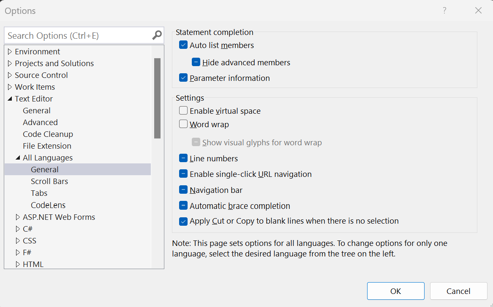

# How to: Display line numbers in the editor

You can display or hide line numbering in your code.

## Display line numbers in code

1. On the menu bar, choose **Tools** > **Options**. Expand the **Text Editor** node, and then select either the language you're using or **All Languages** to turn on line numbers in all languages. (Or, type **line number** in the search box and choose **Turn line numbers on or off** from the results.)

2. Select the **Line numbers** checkbox.

   

> [!TIP]
> Line numbers aren't added to your code; they're just for reference. If you want line numbers to print, in the **Print** dialog box, select the **Include line numbers** check box.

## See also

- [Features of the code editor](../../ide/writing-code-in-the-code-and-text-editor.md)