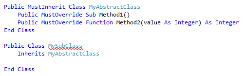
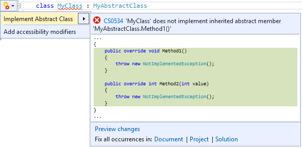
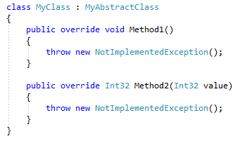
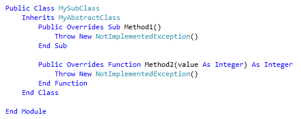

# Implement an abstract class in Visual Studio

This code generation applies to:

- C#

- Visual Basic

**What:** Lets you immediately generate the code required to implement an abstract class.

**When:** You want to inherit from an abstract class.

**Why:** You could manually implement all abstract members one-by-one, however this feature will generate all method signatures automatically.

## How-to

1. Place your cursor on the line where there is a red squiggle that indicates you have inherited from an abstract class, but have not implemented all required members.

   - C#:

       

   - Visual Basic:

       

2. Next, do one of the following:

   - **Keyboard**
      - Press **Ctrl**+**.** to trigger the **Quick Actions and Refactorings** menu.
   - **Mouse**
      - Right-click and select the **Quick Actions and Refactorings** menu.
      - Hover over the red squiggle and click the  icon that appears.
      - Click the  icon that appears in the left margin if the text cursor is already on the line with the red squiggle.

   

3. Select **Implement Abstract Class** from the drop-down menu.

   > [!TIP]
   > - Use the **Preview changes** link at the bottom of the preview window [to see all of the changes](../../ide/preview-changes.md) that will be made before making your selection.
   > - Use the **Document**, **Project**, and **Solution** links at the bottom of the preview window to create the proper method signatures across multiple classes that inherit from the abstract class.

   The abstract method signatures are created, and are ready to be implemented.

   - C#:

       

   - Visual Basic:

       

## See also

- [Code Generation](../code-generation-in-visual-studio.md)
- [Preview Changes](../../ide/preview-changes.md)
