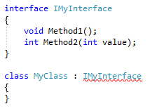
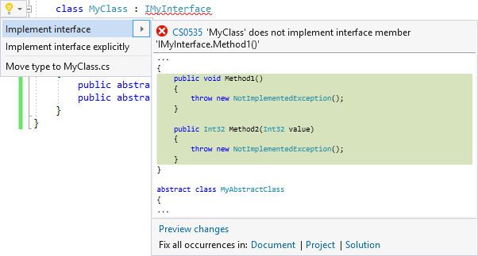
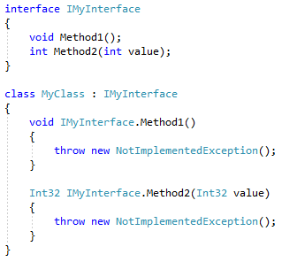

# Implement an interface in Visual Studio

This code generation applies to:

- C#

- Visual Basic

**What:** Lets you immediately generate the code required to implement an interface.

**When:** You want to inherit from an interface.

**Why:** You could manually implement all interface one-by-one, however this feature will generate all method signatures automatically.

## How-to

1. Place your cursor on the line where there is a red squiggle that indicates you have referenced an interface, but have not implemented all required members.

   - C#:

       

   - Visual Basic:

       

2. Next, do one of the following:

   - **Keyboard**
      - Press **Ctrl**+**.** to trigger the **Quick Actions and Refactorings** menu.
   - **Mouse**
      - Right-click and select the **Quick Actions and Refactorings** menu.
      - Hover over the red squiggle and click the  icon that appears.
      - Click the  icon that appears in the left margin if the text cursor is already on the line with the red squiggle.

3. Select **Implement interface** from the drop-down menu.

   

   > [!TIP]
   > - Use the **Preview changes** link at the bottom of the preview window [to see all of the changes](../../ide/preview-changes.md) that will be made before making your selection.
   > - Use the **Document**, **Project**, and **Solution** links at the bottom of the preview window to create the proper method signatures across multiple classes that implement the interface.

   The interface's method signatures is created, and is ready to be implemented.

   - C#:

       

   - Visual Basic:

       

   > [!TIP]
   > (C# only) Use the **Implement interface explicitly** option to preface each generated method with the interface name to avoid name collisions.
   >
   > ;

## See also

- [Code Generation](../code-generation-in-visual-studio.md)
- [Preview Changes](../../ide/preview-changes.md)
