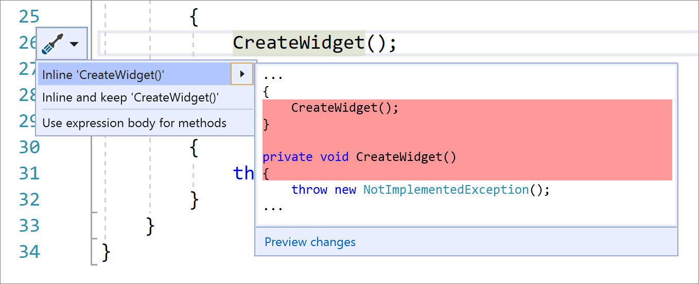

# Inline method

This refactoring applies to:

- C#

- Visual Basic

**What:** Inline method refactoring. 

**When:** You want to replace usages of a static, instance, and extension method within a single statement body with an option to remove the original method declaration.

**Why:**  This refactoring will provide a more clear syntax.

## How-to

1. Place your caret on the usage of the method.

2. Press **Ctrl**+**.** to trigger the **Quick Actions and Refactorings** menu.

3. Select from one of the following options: 
    
   Select **Inline `<QualifiedMethodName>`** to remove the inline method declaration:

    

   Select **Inline and keep `<QualifiedMethodName>`** to preserve the original method declaration:

    

## See also

- [Refactoring](../refactoring-in-visual-studio.md)
