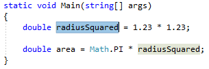
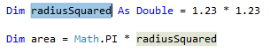
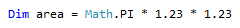

# Inline a temporary variable refactoring

This refactoring applies to:

- C#

- Visual Basic

**What:** Lets you remove a temporary variable and replace it with its value instead.

**When:** The use of the temporary variable makes the code harder to understand.

**Why:** Removing a temporary variable may make the code easier to read.

## How-to

1. Highlight or place the text cursor inside the temporary variable to be inlined:

   - C#:

       

   - Visual Basic:

       

2. Next, do one of the following:

   - **Keyboard**
      - Press **Ctrl**+**.** to trigger the **Quick Actions and Refactorings** menu.
   - **Mouse**
      - Right-click the code and select the **Quick Actions and Refactorings** menu.

3. Select **Inline temporary variable** from the Preview window popup.

   The variable is removed and its usages replaced by the value of the variable.

   - C#:

      

   - Visual Basic:

      

## See also

- [Refactoring](../refactoring-in-visual-studio.md)
