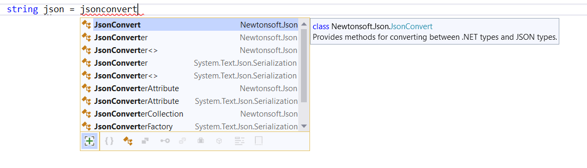

# IntelliSense completion for unimported types and extension methods

This refactoring applies to:

- C#

- Visual Basic

**What:** IntelliSense gives completion for unimported types and extension methods.

**When:** You want to use a type or extension method with a dependency in your project, but the `using` statement isn't added to your file.

**Why:** You don't have to manually add the `using` statement to your file.

## How-to

1. After you start to enter the name of a type or extension method with a dependency in your project, IntelliSense shows you suggestions. In the list, items from unimported namespaces are shown with their containing namespace as a suffix.

   :::moniker range="visualstudio"

   > [!TIP]
   > You can show/hide items from unimported namespaces on demand by selecting **Expander** next to the completion list. (Or use the **Alt**+**A** keyboard shortcut.)
   >
   > To change the default behavior, open the **Tools** > **Options** pane and expand the **All Settings** > **Languages** > **C#** (or **Visual Basic**) > **IntelliSense** section. Select or clear the **Show items from unimported namespaces** checkbox.

   :::moniker-end
   :::moniker range="<=vs-2022"

   > [!TIP]
   > You can show/hide items from unimported namespaces on demand by selecting **Expander** next to the completion list. (Or use the **Alt**+**A** keyboard shortcut.)
   >
   > To change the default behavior, open the **Tools** > **Options** dialog and expand the **Text Editor** > **C#** (or **Visual Basic**) > **IntelliSense** section. Select or clear the **Show items from unimported namespaces** checkbox, and then select **OK**.

   :::moniker-end

1. Select a suggestion and commit an unimported item.

   The `using` statement is automatically added to your file.

   

## See also

- [IntelliSense](../using-intellisense.md)
- [Refactoring](../refactoring-in-visual-studio.md)
