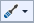
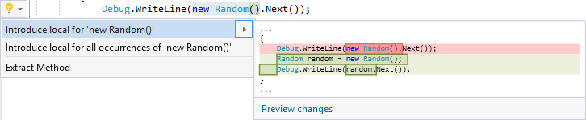
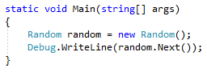

# Introduce a local variable in Visual Studio

This code generation applies to:

- C#

- Visual Basic

**What:** Lets you immediately generate a local variable to replace an existing expression.

**When:** You have code which could be easily reused later if it were in a local variable.

**Why:** You could copy and paste the code multiple times to use it in various locations, however it would be better to perform the operation once, store the result in a local variable, and use the local variable throughout.

## How-to

1. Highlight the expression that you want to assign to a new local variable.

   - C#:

       

   - Visual Basic:

       

2. Next, do one of the following:

   - **Keyboard**
      - Press **Ctrl**+**.** to trigger the **Quick Actions and Refactorings** menu.
   - **Mouse**
      - Right-click and select the **Quick Actions and Refactorings** menu.
      - Click the  icon that appears in the left margin if the text cursor is already on the line with the highlighted expression.

   

3. Select **Introduce local for (all occurrences) of 'expression'** from the drop-down menu.

   > [!TIP]
   > Use the **Preview changes** link at the bottom of the preview window [to see all of the changes](../../ide/preview-changes.md) that will be made before making your selection.

   The local variable is created, with the type inferred from its usage. Give the new local variable a new name.

   - C#:

       

   - Visual Basic:

       

   > [!NOTE]
   > You can use the **...all occurrences of...** menu option to replace every instance of the selected expression, not just the one you have specifically highlighted.

## See also

- [Code generation](../code-generation-in-visual-studio.md)
- [Preview changes](../../ide/preview-changes.md)
