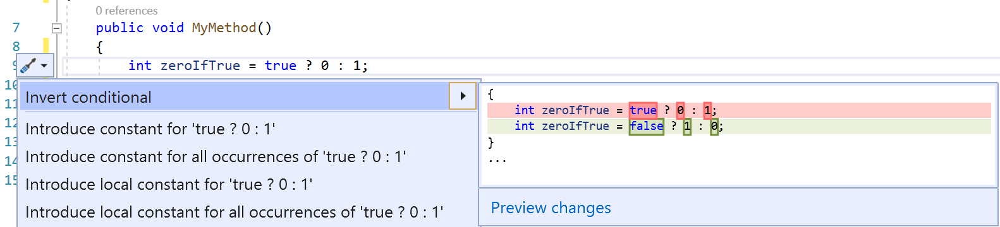
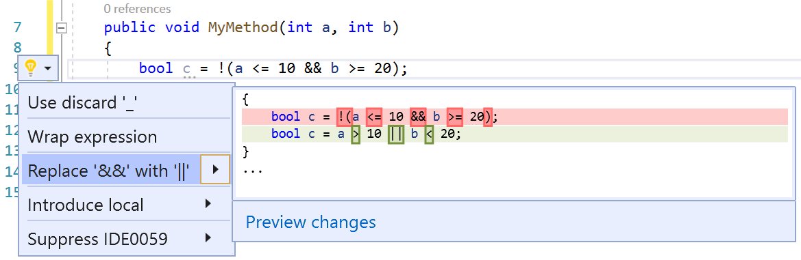

# Invert conditional expressions and conditional AND/OR operators

This refactoring applies to:

- C#
- Visual Basic

**What:** Lets you invert a conditional expression or a conditional AND/OR operator.

**When:** You have a conditional expression or conditional AND/OR operator that would be better understood if inverted.

**Why:** Inverting an expression or conditional AND/OR operator by hand can take much longer and possibly introduce errors. This code fix helps you do this refactoring automatically.

## Invert conditional expressions and conditional AND/OR operators refactoring

1. Place your cursor in a conditional expression or a conditional AND/OR operator.
2. Press **Ctrl**+**.** to trigger the **Quick Actions and Refactorings** menu.
3. Select **Invert conditional** or **Replace '&&' with '||'**

    

    

## See also

- [Refactoring](../refactoring-in-visual-studio.md)
- [Productivity features](../productivity-features.md)
