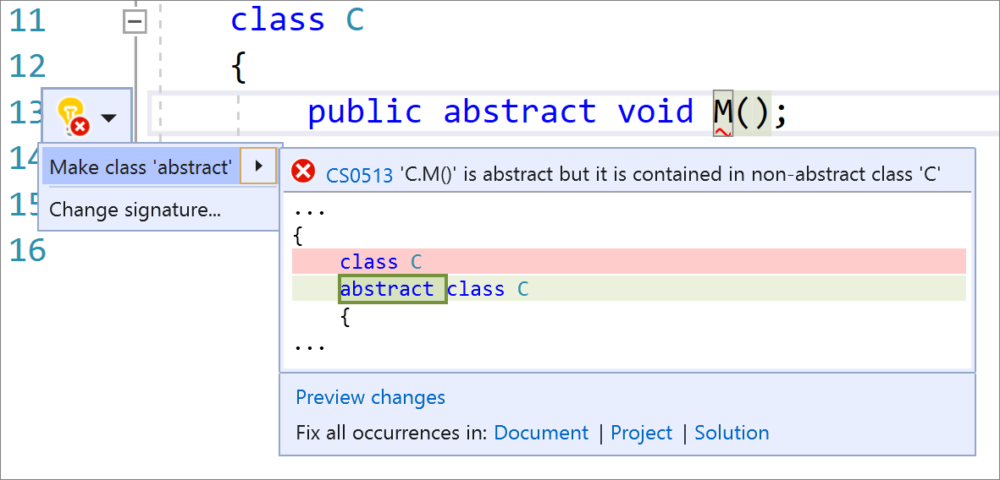

# Make class abstract

This refactoring applies to:

- C#

- Visual Basic

**What:** Make class abstract refactoring.

**When:** You write an abstract method in a class that is not abstract.

**Why:**  Having a code fix to make a class abstract after writing an abstract method will save you time.

## How-to

1. Place your caret on the abstract method.

2. Press **Ctrl**+**.** to trigger the **Quick Actions and Refactorings** menu.

3. Select **Make class 'abstract'**.

    

## See also

- [Refactoring](../refactoring-in-visual-studio.md)
