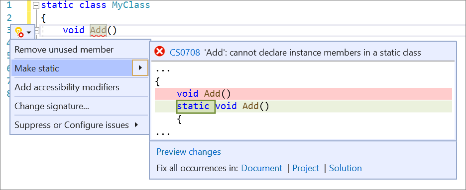

# Make member static

This refactoring applies to:

- C#

**What:** Make a member static.

**When:** You want a non-static member to be static.

**Why:** Static members improve readability: knowing that specific code is isolated makes it easier to understand, reread, and reuse. 

## How-to

1. Place your caret on the member name.

2. Press **Ctrl**+**.** (period) to trigger the **Quick Actions and Refactorings** menu.

   

3. Select **Make static**.

## See also

- [Refactoring](../refactoring-in-visual-studio.md)
